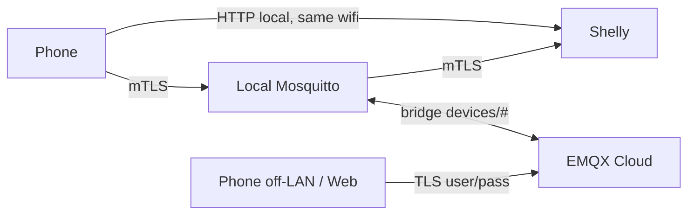

# CLAUDE.md

## Project overview

Shelly Coffee Timer — a Shelly Plug S Gen3 smart plug that controls a coffee maker via countdown timers. No home server, no hub. Control paths: physical button, local HTTP (same wifi, always available), and MQTT — over a **local Mosquitto broker (mTLS)** bridged to **EMQX Cloud Serverless** for off-LAN access. The device also runs a **connectivity watchdog** that reboots and resumes state on prolonged connectivity loss. An Android app (Kotlin/Compose) and an HTML fallback page provide the phone/computer interface.

Safety-first: every "on" state is a countdown (max 180 min). Power loss = OFF. Schedule fires once then disarms. Watchdog resume only on a software/watchdog reboot (`reset_reason == 3`), never on mains power loss.

> **This is v2** (local MQTT). The prior **v1 used Adafruit IO** — archived under `docs/archive/` (frozen at the `adafruit-final` tag). Some `scripts/*.sh` and `.env.example` are still v1/Adafruit-era and pending a v2 cleanup; the live v2 test entry point is `scripts/test-device.sh`.

## Tech stack

| Component | Tech | Location |
|-----------|------|----------|
| Device script | mJS (JavaScript subset on ESP32) | `device/coffee.js` (source) → `device/coffee.min.js` (deploy artifact; full source OOMs the heap) |
| Android app | Kotlin, Jetpack Compose | `app/` |
| Web fallback | Vanilla HTML/CSS/JS (MQTT over WSS) | `web/index.html` |
| Helper scripts | Bash + curl/node | `scripts/` |
| Broker | Local Mosquitto (mTLS) bridged to EMQX Cloud Serverless | Pi `mqtt` + external EMQX |

## Key directories

- `docs/spec/` — Specification docs. v2 design: **11** (local-MQTT re-arch), **12** (watchdog validation). v1 foundational: 00–03, 05–10 (transport bits superseded — see `docs/spec/INDEX.md`).
- `docs/testing/` — Test guides: AI-TEST-GUIDE.md (automated), REGRESSION.md (manual checklist).
- `docs/` — Operational docs: ARCHITECTURE.md (v2 system diagram and flows).
- `docs/archive/` — v1 Adafruit docs + the v2 build/validation record (IMPLEMENTATION.md, HW-VALIDATION-v2.md).
- `device/` — mJS script; deploy the **minified** `coffee.min.js` (built by `scripts/build-device.sh`) via RPC `Script.PutCode`.
- `app/` — Android Studio project (Kotlin/Compose).
- `app/.../notification/` — Foreground notification service (4 files).
- `web/` — Self-contained HTML control page, MQTT-over-WSS to EMQX (deployed to GitHub Pages).
- `scripts/` — Bash/node utilities (`build-device.sh`, `test-device.sh`; plus v1/Adafruit-era scripts pending cleanup).
- `.github/workflows/` — CI/CD: APK build, release, GitHub Pages deploy.

## Credentials

IMPORTANT: This repo is **public**. No real keys, usernames, IPs, hostnames, device IDs, or MACs in committed files.

- All secrets live in `.env` (gitignored via `*.env`). Template: `.env.example` (⚠️ still lists v1 `AIO_*` vars — pending a v2 update to broker hosts / cloud user+pass / Shelly IP).
- **v2 secrets:** cloud MQTT (EMQX) username/password, local broker host, the client **`.p12`** identity + its password, and the Shelly IP. The `.p12` is **never committed** (gitignored, imported on-device); the bundled CA cert in `app/.../res/raw/` is the **public** CA cert (safe to ship).
- The app stores cloud creds + the `.p12` password in `SharedPreferences` (prod-hardening TODO: `EncryptedSharedPreferences`); `web/index.html` keeps cloud creds in `localStorage` — never hardcoded.
- `device/coffee.js` uses a placeholder `DEVICE` id; the MQTT transport (broker, mTLS certs, topic_prefix) is configured on the device via RPC `Mqtt.SetConfig`, not in the script (see spec 11 §5).

## mJS constraints

The Shelly mJS runtime is severely limited. When writing or modifying `device/coffee.js`:

- No Promises, no async/await, no template literals, no arrow functions
- No `Array.indexOf()`, no `String.split()`, no `String.padStart()`
- `JSON.parse()` returns `undefined` on failure (not `null`)
- KVS operations are async with callbacks — must be chained sequentially (see below)
- Single-threaded cooperative execution — no blocking loops
- HTTP request size limit: 3072 bytes total

### Lessons learned from implementation (Phase 2)

- **Max ~4-5 concurrent timers.** Exceeding this crashes the script. Consolidate into fewer timers with counter-based dispatch (e.g., one 30s timer handles tick, schedule check, and heartbeat).
- **Max ~3 concurrent Shelly.call().** Firing 6 parallel KVS.Get calls causes "too many calls in progress" crash. Chain them sequentially instead of parallel.
- **Shelly.call userdata (4th param) is unreliable** — always arrives as empty string in callbacks. Use closure-captured variables instead.
- **Plug S Gen3 has no separate Input component.** The physical button toggles the switch directly in firmware — there is no `single_push` or `btn_down` event. Both button presses and `Switch.Set` calls fire the same status change on `switch:0`. Use a `script_switching` flag: set it before calling `Switch.Set`, clear it in the callback. The status handler ignores changes when the flag is set, and treats changes when the flag is clear as physical button presses.
- **Script.PutCode append mode.** Large scripts may need multiple PutCode calls with `append: true` after the first chunk.
- **Script upload via RPC.** No need to paste into web UI — use `Script.Create` + `Script.PutCode` + `Script.Start` + `Script.SetConfig` (enable: true for auto-start).

## Communication architecture



MQTT topics under `devices/<DEVICE>/`: `command` (→device), `config` (→device, retained), `heartbeat` (←device, retained). Separate liveness topic `mon/<DEVICE>/alive` (LAN-only, outside the bridged `devices/#`). Device `online` LWT is firmware-published.

Native MQTT **retain** is used (no `/get` workaround). Config is version-gated: the device rejects `config` with `v <= cfg_v`, so controllers publish `v+1`. The heartbeat + HTTP `coffee_status` carry `v`/`dur`/`max` so any client knows the current version without a separate read.

### v2 broker / transport notes

- **mJS `MQTT.*` shares the device's single built-in MQTT connection** — it does NOT open a second client. MQTT-over-TLS + a running script can be flap-prone on Gen3; keep firmware current, set a stable `client_id`, minimise script MQTT churn.
- **`status_ntf`/`rpc_ntf` must be `false`.** With them on, the firmware publishes its full `devices/<id>/status/#` tree (power metering every few seconds) which the bridge mirrors to cloud and burns the free-tier quota. The `online` LWT does **not** depend on them.
- **Bridge mirrors `devices/#` both ways.** Keep high-frequency signals (`alive`) under `mon/` so they stay LAN-side.
- **App connection roaming:** the phone prefers HTTP-direct > local-broker mTLS > cloud, re-evaluated every poll; MQTT is dropped when backgrounded with no foreground service (avoids keepalive churn under Doze).

## Git workflow

- Commit directly to `main` unless otherwise specified.
- AI agents can commit and push to `main`.
- Use **semantic commit messages**, subject line max **70 characters**.
  ```
  feat: add schedule time picker to Android app
  fix: prevent timer extension beyond max cap
  docs: update deployment troubleshooting section
  refactor: extract heartbeat publishing to helper
  test: add REST round-trip validation script
  chore: update .gitignore for Android build artifacts
  ```
- Feature branches for experimental or breaking work.

## CI/CD

GitHub Actions workflows in `.github/workflows/`:

- **build.yml** — Builds debug APK on every push to `main`. APK uploaded as GitHub Actions artifact (downloadable from the workflow run page).
- **release.yml** — On push of a `v*` tag: builds APK, generates changelog from commits, creates GitHub Release with APK attached.
- **deploy-pages.yml** — Deploys `web/` to GitHub Pages on push to `main` (only when `web/**` changes).

### Downloading APKs

- **Latest build:** Go to the [Actions tab](https://github.com/Laffs2k5/shelly-coffee-timer/actions/workflows/build.yml), click the most recent run, scroll to "Artifacts", download `debug-apk`.
- **Release builds:** Go to [Releases](https://github.com/Laffs2k5/shelly-coffee-timer/releases), download the APK from the latest release.

## Notification service

The Android app includes a foreground notification service (`notification/` package, 4 files):

| Component | Purpose |
|-----------|---------|
| `CoffeeNotificationService` | Foreground service that polls device every 30s, shows "Coffee ON -- N min remaining" notification, self-stops when coffee turns off |
| `NotificationHelper` | Creates notification channel, builds/updates/cancels notifications |
| `ScheduleAlarmManager` | Sets `AlarmManager` exact alarm for scheduled coffee time, starts notification service when alarm fires |
| `ScheduleAlarmReceiver` | `BroadcastReceiver` that starts the service on alarm fire |

Key behavior:
- Service only runs while coffee is actively ON (no background drain when off).
- Between polls, service counts down locally (1 min/min) for smooth display.
- After 10 consecutive poll failures (~5 min), notification shows "Connection lost".
- Schedule alarm is re-armed on every successful poll where `sch=1`, catching schedules set from any client.

## Testing

**v2 automated tests** (no hardware — Node `node:test` harness mocking the Shelly runtime + web logic):

```bash
scripts/test-device.sh       # 33 tests: device mJS logic (mocked Shelly) + web logic
node --test 'device/test/*.test.js'
```

App logic (pure connection/decide/event-log) has JVM unit tests: `gradlew testDebugUnitTest` (Windows toolchain). Hardware/phone validation is recorded in `docs/archive/HW-VALIDATION-v2.md`.

> The other `scripts/*.sh` (`test-all`, `test-remote-api`, `test-rest`, `test-mqtt`, `setup-feeds`, `send-command`, …) are **v1/Adafruit-era**, run against the old REST/MQTT path, and are pending a v2 cleanup. See `docs/testing/AI-TEST-GUIDE.md` and `docs/testing/REGRESSION.md` for the current v2 procedures.

## Development environment

This project is developed on a **Windows ARM64 Surface laptop** running **WSL2 (Ubuntu, aarch64)**.

### Build constraints
- **Android APK cannot be built in WSL** — the Android SDK's `aapt2` is x86_64 only. Build on Windows via Android Studio or Gradle with Windows SDK.
- The built APK lives under the Windows build project's `build/outputs/apk/debug/`.
- Install to phone via the Android SDK's `platform-tools/adb.exe install -r <apk_path>`.

### Android emulator — does NOT work on this Windows-on-ARM machine
The x86_64 emulator can't run ARM64 AVDs (architecture mismatch), and x86_64 AVDs require hardware virtualization (unavailable on ARM). **Test on a physical device.**

**Re-verified 2026-06-05** (official emulator release notes through v36.6.11; Microsoft Surface Snapdragon Q&A): the Android Emulator is still **x86_64-only on Windows — no native Windows-on-ARM (Snapdragon) build exists**, canary or otherwise. Native ARM64 host support exists only for **Linux** (cross-compile + KVM) and **macOS** (Apple Silicon), not Windows. Android Studio itself also has no native Windows-ARM64 build — it runs under x64 translation (~10-20% slower). A Linux-ARM64 emulator could in theory run inside WSL2, but WSL2 doesn't expose KVM/nested-virt here, so it's not practical. Bottom line unchanged: **physical device, or build/emulate on an x86_64 host.**

### WSL interop
- Windows executables (`.exe`) can be called from WSL via binfmt_misc.
- The `WSLInterop` binfmt handler can get unregistered. Re-register: `sudo sh -c 'echo ":WSLInterop:M::MZ::/init:PF" > /proc/sys/fs/binfmt_misc/register'`
- `claude.exe` can be invoked from WSL for Windows-side tasks: use `-p "prompt"` and `--dangerously-skip-permissions` for non-interactive mode.
- Background execution of Windows binaries via the Bash tool's `run_in_background` fails (exec format error). Must run in foreground.

### Relay / device control

WSL can't reach the LAN; drive the Shelly from **Windows** via `pwsh.exe` RPC. Verify relay state with `Switch.GetStatus` (`.result.output`), schedule/config via `KVS.GetMany` (`cfg_*`, `rt`). Reflash the script with chunked `Script.PutCode` (3072-byte HTTP limit → ~1200-char chunks, first `append:false` then `append:true`); the RPC response is under `.result`. (A laptop charger was previously wired through the plug for AC-state verification; no longer connected.)

## Documentation conventions

- **Diagrams must use mermaid syntax**, not ASCII art. Mermaid renders natively on GitHub and in most markdown viewers. Use fenced code blocks with `mermaid` language tag.
- Keep docs concise. Link to code rather than duplicating it.

## Spec docs reference

Full specification: `docs/spec/INDEX.md`. Key docs by topic:

- **v2 local-MQTT re-arch + watchdog: `docs/spec/11-local-mqtt.md`**
- **Watchdog reset-reason validation: `docs/spec/12-watchdog-validation.md`**
- Message formats (incl. v2 `v`/`dur`/`max` heartbeat fields): `docs/spec/03-message-format.md`
- Device state machine: `docs/spec/05-state-machine.md`
- Phone interface: `docs/spec/06-phone-interface.md`
- v1 Adafruit IO setup (archived): `docs/archive/04-adafruit-io.md`

Operational docs:

- Architecture overview: `docs/ARCHITECTURE.md`
- AI test guide: `docs/testing/AI-TEST-GUIDE.md`
- Manual regression: `docs/testing/REGRESSION.md`
