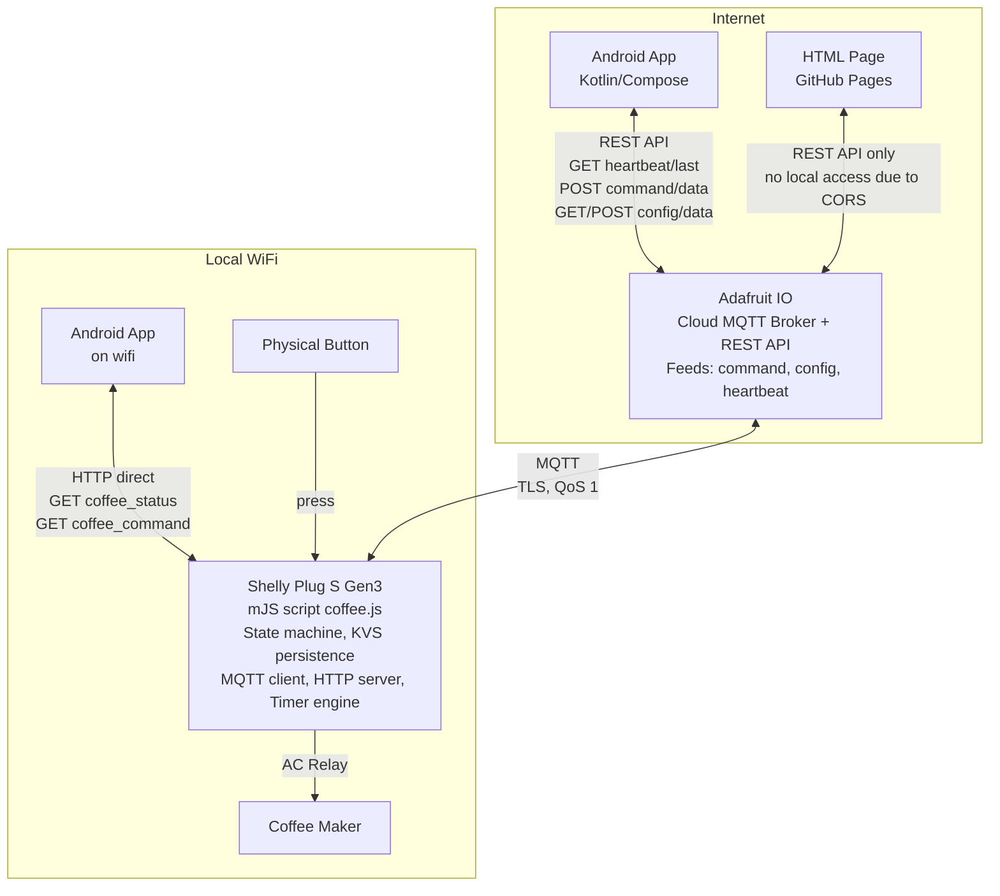
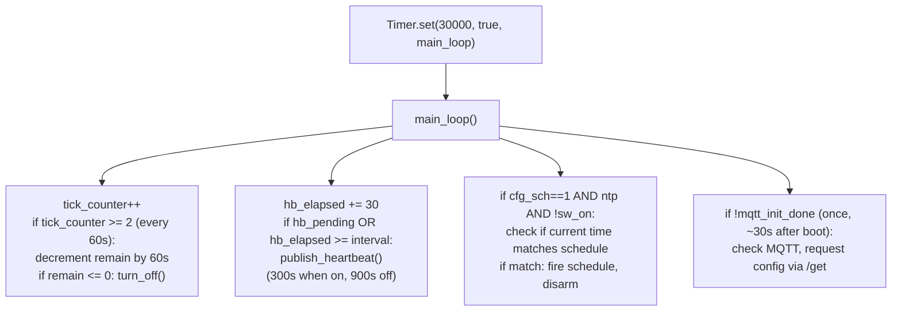
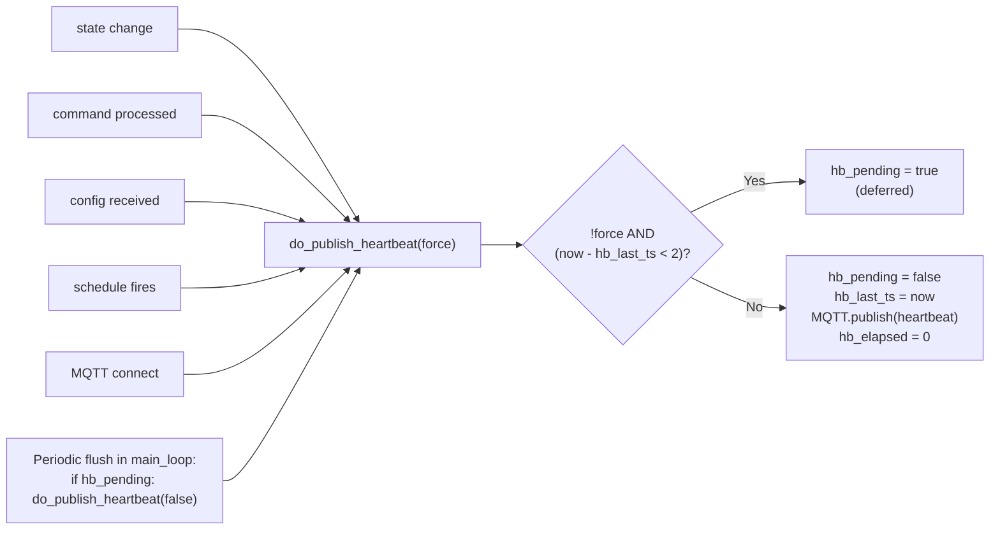
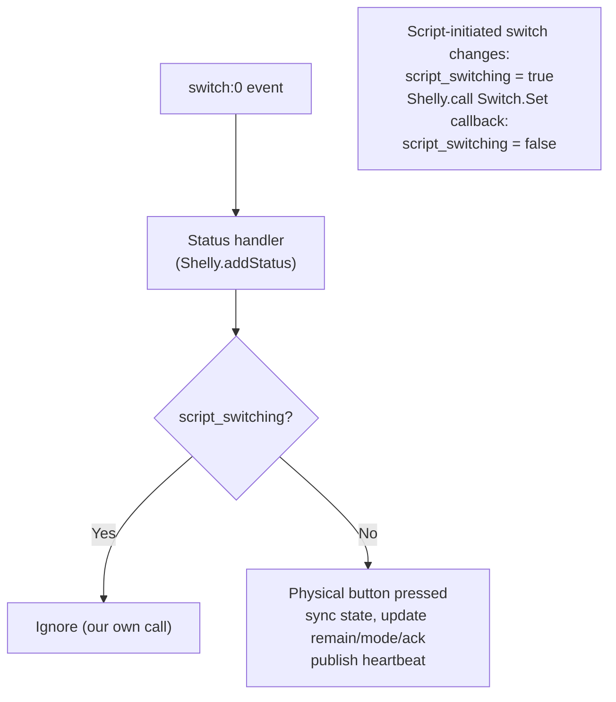
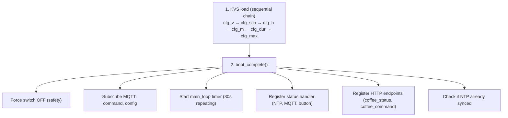
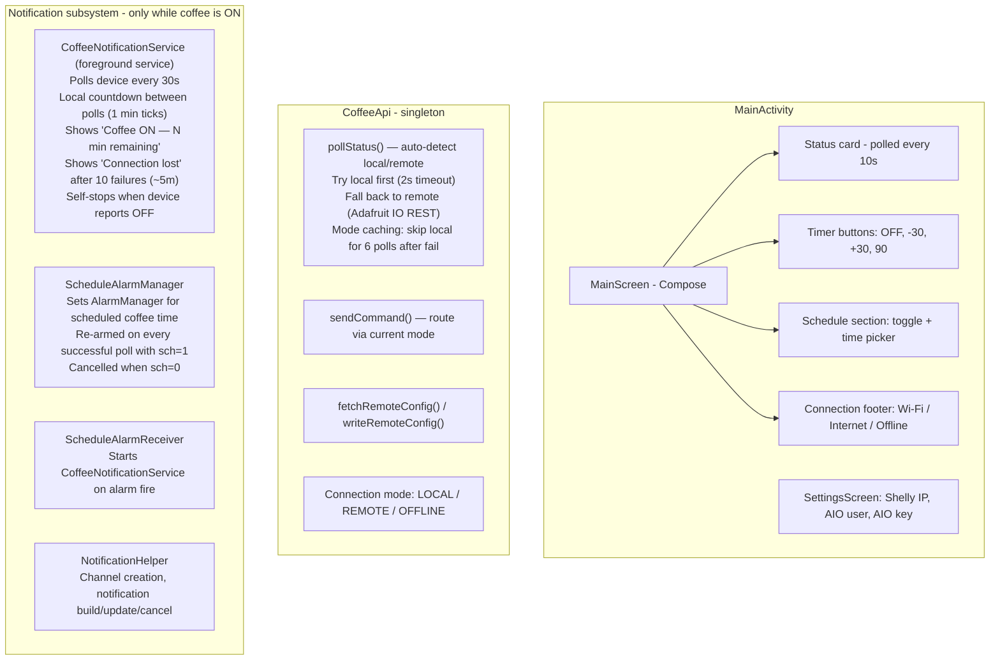
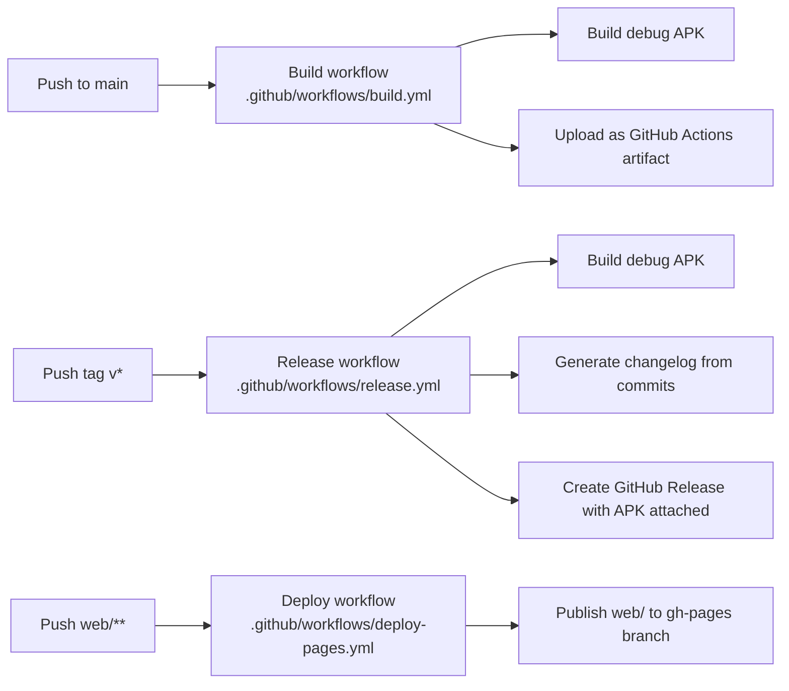

# Architecture Overview

High-level system architecture for the Shelly Coffee Timer project.

---

## System Diagram



---

## Control Paths

| Path | Route | Latency | Requirements |
|------|-------|---------|-------------|
| Physical button | Button → Shelly firmware → mJS status handler | Instant | None (always works) |
| Local HTTP | Phone → wifi → Shelly HTTP → mJS endpoint | ~10ms | Same wifi network |
| Remote MQTT | Phone → REST → Adafruit IO → MQTT → Shelly | 1-5s | Internet on both ends |

---

## On-Device Timer Architecture

The mJS runtime is constrained to ~4-5 concurrent timers. The script uses a single
30-second repeating timer that handles all periodic tasks via counter-based dispatch:



---

## Heartbeat Flow with Debounce

The device publishes heartbeats to Adafruit IO to keep the phone informed. A 2-second
debounce prevents burst publishing when multiple events fire close together.



The `hb_pending` flag ensures deferred heartbeats are flushed on the next 30-second
main_loop cycle, so no state change goes unreported for more than 30 seconds.

---

## Physical Button Detection

The Shelly Plug S Gen3 has no separate Input component. The physical button toggles
the switch directly in firmware. Both button presses and `Switch.Set` API calls fire
the same `switch:0` status change event.



---

## Boot Sequence



---

## Android App Architecture



### Auto-detect Mode Caching

The app tracks `lastMode` and `localFailCount` to optimize polling:

- If last mode was REMOTE, skip the 2-second local timeout on most polls
- Try local again every 6th poll (~60 seconds) to detect returning home
- On local success, reset fail counter and switch to LOCAL immediately

---

## CI/CD Pipeline



---

## Message Formats (Quick Reference)

**Command** (phone to device, via command feed):
```json
{"c":"t90","ts":1711036800}
```

**Config** (phone to device, via config feed):
```json
{"v":25,"sch":1,"h":6,"m":10,"dur":90,"max":180}
```

**Heartbeat** (device to phone, via heartbeat feed):
```json
{"s":"on","r":84,"mode":"remote","sch":0,"h":9,"m":27,"ack":"t90","ts":1774181053,"ntp":true}
```

**Local status** (device HTTP response, longer key names):
```json
{"state":"on","remaining":84,"mode":"remote","sch":0,"h":9,"m":27,"ntp":true,"ts":1774181087}
```
