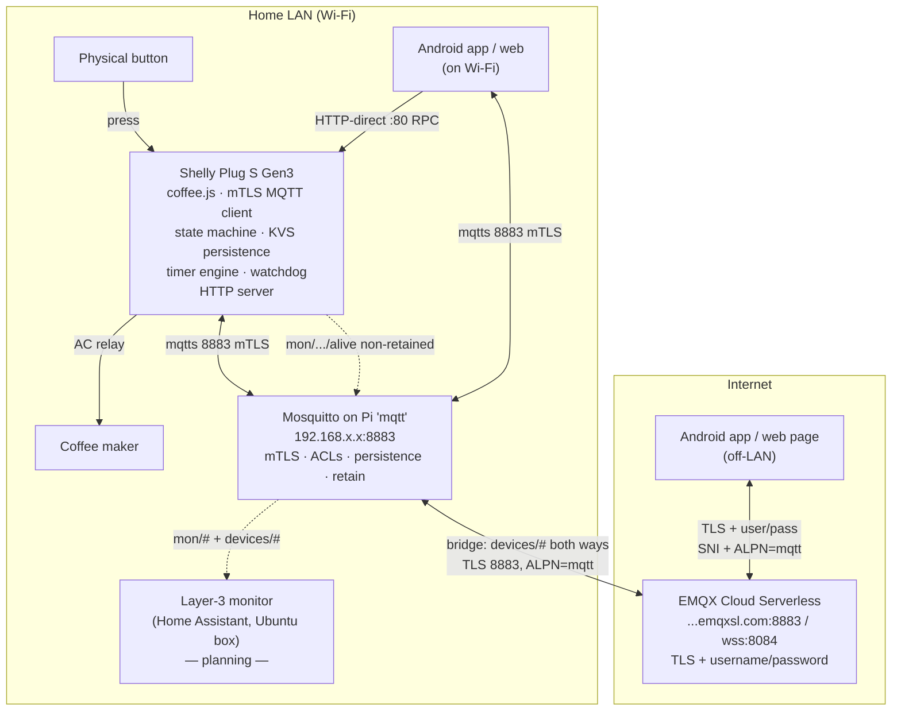
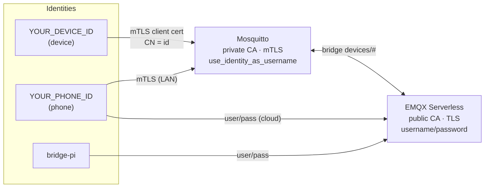
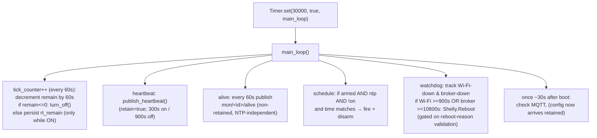
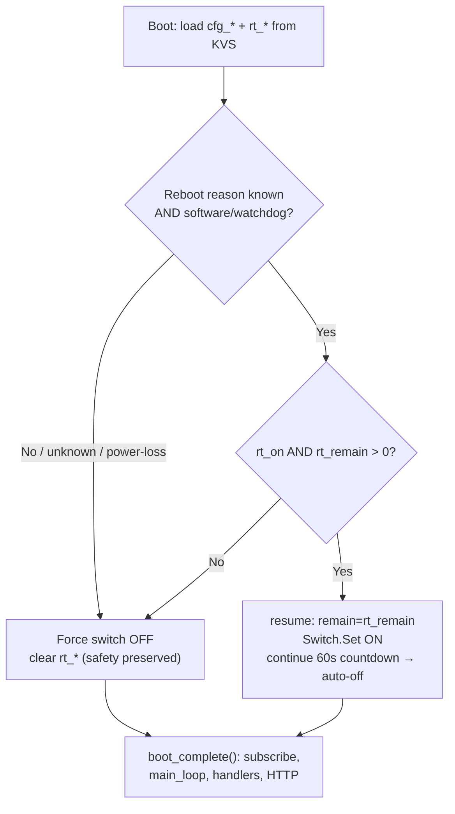
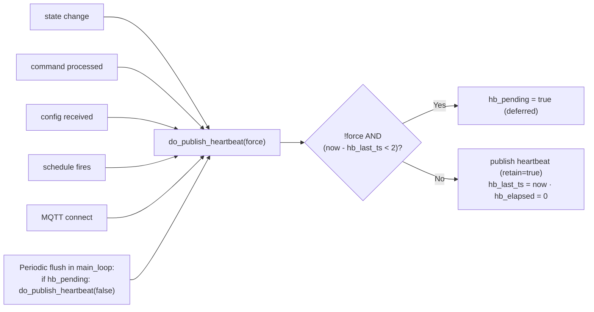
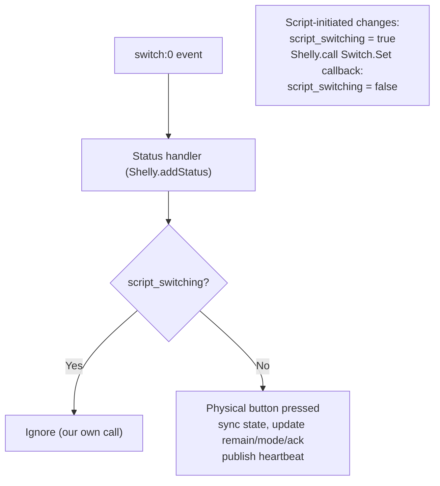
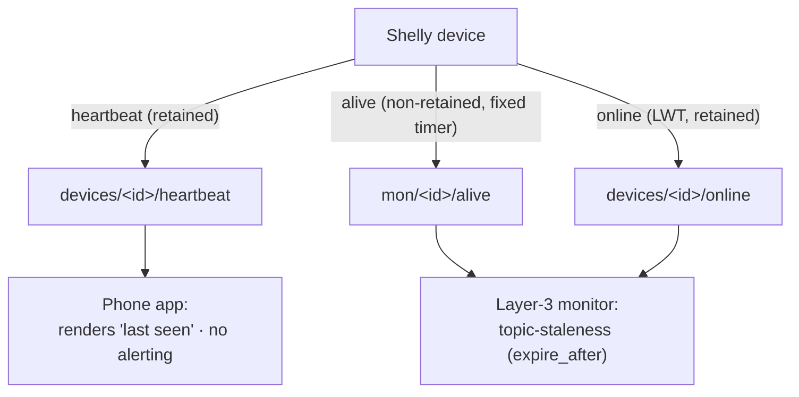
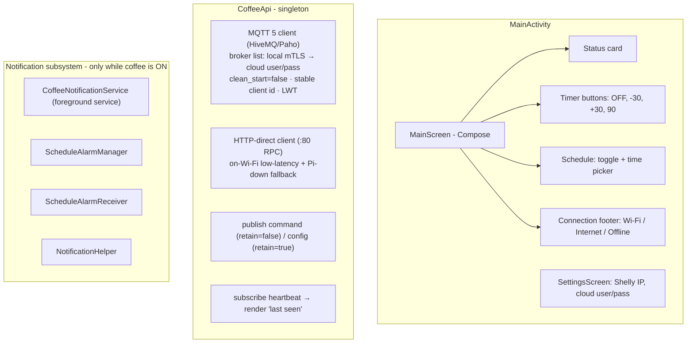
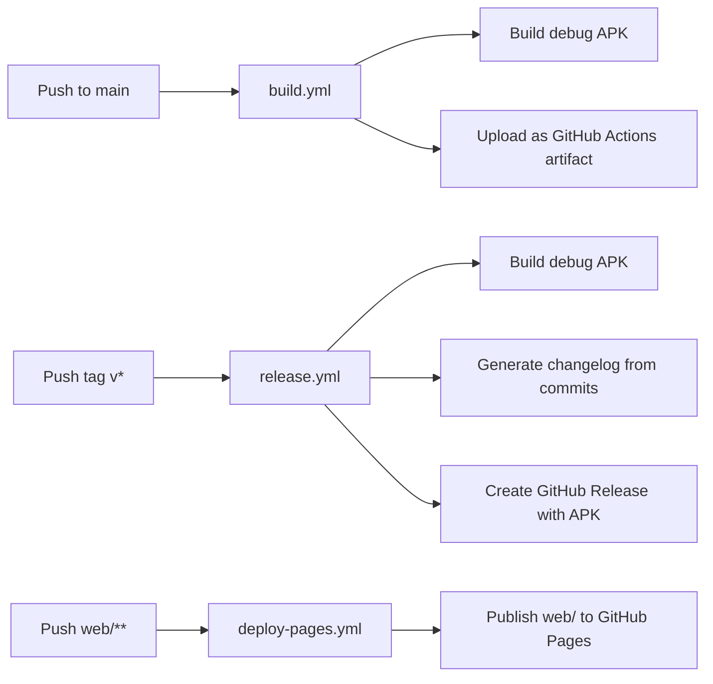

# Architecture Overview (v2 — local MQTT)

> **This is the v2 architecture, validated on hardware (2026-06-06).**
>
> The system runs on the **hybrid MQTT stack** (local Mosquitto on the Pi, mTLS, bridged to
> EMQX Cloud Serverless) with a **connectivity watchdog and state-resume across reboot**. The design
> blueprint is [spec/11-local-mqtt.md](spec/11-local-mqtt.md); this doc is the high-level picture that
> flows from it.
>
> - **Superseded:** the v1.x Adafruit IO design — snapshot in
>   [archive/ARCHITECTURE-adafruit.md](archive/ARCHITECTURE-adafruit.md), frozen at the `adafruit-final` tag.
> - **Watchdog/resume gate:** reboot-reason detection validated on hardware (2026-06-05) —
>   `sys.reset_reason` distinguishes a software/watchdog reboot (`3`, resume) from a power loss
>   (`1`, boot OFF). See [spec/12-watchdog-validation.md](spec/12-watchdog-validation.md).

High-level system architecture for the Shelly Coffee Timer project.

---

## System Diagram


```mermaid
graph TD
    subgraph LAN["Home LAN (Wi-Fi)"]
        Button["Physical button"]
        Shelly["Shelly Plug S Gen3<br/>coffee.js · mTLS MQTT client<br/>state machine · KVS persistence<br/>timer engine · watchdog<br/>HTTP server"]
        Coffee["Coffee maker"]
        Mosq["Mosquitto on Pi 'mqtt'<br/>192.168.x.x:8883<br/>mTLS · ACLs · persistence · retain"]
        PhoneLan["Android app / web<br/>(on Wi-Fi)"]
        Monitor["Layer-3 monitor<br/>(Home Assistant, Ubuntu box)<br/>— planning —"]

        Button -->|press| Shelly
        Shelly -->|AC relay| Coffee
        Shelly <-->|mqtts 8883 mTLS| Mosq
        Shelly -.->|mon/.../alive non-retained| Mosq
        PhoneLan -->|HTTP-direct :80 RPC| Shelly
        PhoneLan <-->|mqtts 8883 mTLS| Mosq
        Mosq -.->|mon/# + devices/#| Monitor
    end

    subgraph Cloud["Internet"]
        EMQX["EMQX Cloud Serverless<br/>...emqxsl.com:8883 / wss:8084<br/>TLS + username/password"]
        PhoneOff["Android app / web page<br/>(off-LAN)"]
    end

    Mosq <-->|bridge: devices/# both ways<br/>TLS 8883, ALPN=mqtt| EMQX
    PhoneOff <-->|TLS + user/pass<br/>SNI + ALPN=mqtt| EMQX
```

- **Device** speaks to the **local broker only** (mTLS, LAN). It never connects to the cloud and is
  simply offline while the Pi/broker is down (e.g. the nightly 04:00 reboot).
- **Phone** carries a **broker list**: local (mTLS) on Wi-Fi, falling back to cloud (user/pass)
  off-LAN. Cloud control reaches the device over the bridge.
- **Liveness** (`mon/<id>/alive`) lives on a separate top-level `mon/` root, **outside** the bridged
  `devices/#` tree, so it stays LAN-side for the monitor and never burns cloud traffic.

---

## Control Paths

| Path | Route | Latency | Requirements |
|------|-------|---------|-------------|
| Physical button | Button → Shelly firmware → mJS status handler | Instant | None (always works) |
| **HTTP-direct (local)** | Phone → Wi-Fi → Shelly HTTP :80 → mJS endpoint | ~10 ms | Same Wi-Fi. **Hard req: always works, broker up or down** |
| MQTT — local | Phone → Mosquitto (mTLS) → Shelly | <1 s | Same Wi-Fi + Pi up |
| MQTT — remote | Phone → EMQX (user/pass) → bridge → Mosquitto → Shelly | 1–5 s | Internet + Pi + bridge up |

The physical button and HTTP-direct are the **broker-independent** paths — the controls that survive a
Pi/broker outage. Safety invariants (timer, auto-off, 180-min cap) never depend on MQTT.

---

## Transport & Authentication


```mermaid
graph LR
    subgraph Identities
        Dev["YOUR_DEVICE_ID<br/>(device)"]
        Phone["YOUR_PHONE_ID<br/>(phone)"]
        Bridge["bridge-pi"]
    end
    Dev -->|mTLS client cert<br/>CN = id| Local["Mosquitto<br/>private CA · mTLS<br/>use_identity_as_username"]
    Phone -->|"mTLS (LAN)"| Local
    Phone -->|"user/pass (cloud)"| CloudB["EMQX Serverless<br/>public CA · TLS<br/>username/password"]
    Bridge -->|user/pass| CloudB
    Local <-->|bridge devices/#| CloudB
```

| | Local (Mosquitto) | Cloud (EMQX Serverless) |
|---|---|---|
| Host | `192.168.x.x` / `mqtt.local` | `…emqxsl.com` |
| Port | 8883 (mqtts) | 8883 (mqtts) / 8084 (wss) |
| TLS trust | private CA (bundled) | public CA (system store) |
| Client auth | mTLS client cert (CN = identity) | username + password |
| SNI / ALPN | not required | required (SNI = host, ALPN = `mqtt`) |

Certs are issued by an offline private CA (operator-side) and uploaded to the device via RPC. ACLs are
deny-by-default and per-identity (`devices/%u/#` + `mon/%u/#`). The bridge and ACLs are operator-owned.

---

## Topic Scheme

| Topic | Dir | Retain | Purpose |
|---|---|---|---|
| `devices/YOUR_DEVICE_ID/command` | phone → device | **NO** | commands (`on`/`off`/`ext`/`sub`/`t90`); staleness-checked, never replayed |
| `devices/YOUR_DEVICE_ID/config` | phone → device | **YES** | desired config; device gets latest on every (re)connect |
| `devices/YOUR_DEVICE_ID/heartbeat` | device → phone | **YES** | the app's "last seen"; phone gets last value on subscribe |
| `mon/YOUR_DEVICE_ID/alive` | device → monitor | **NO** | infra liveness; payload irrelevant; LAN-only (outside the bridge) |
| `devices/YOUR_DEVICE_ID/online` | device → all | YES | Shelly built-in LWT (automatic, no script code) |

Native MQTT **retain** replaces the Adafruit `/get` and REST `/data/last` workarounds entirely.
Payload formats (the command/config/heartbeat JSON) are unchanged from v1 — see
[spec/03-message-format.md](spec/03-message-format.md).

---

## On-Device Timer Architecture

The mJS runtime is constrained to ~4–5 concurrent timers and ~3 concurrent `Shelly.call()`s. A single
30-second repeating timer drives everything via counter-based dispatch — in v2 it also runs the
connectivity watchdog and the `alive` publish:


```mermaid
flowchart TD
    Timer["Timer.set(30000, true, main_loop)"] --> ML["main_loop()"]

    ML --> Tick["tick_counter++ (every 60s):<br/>decrement remain by 60s<br/>if remain<=0: turn_off()<br/>else persist rt_remain (only while ON)"]
    ML --> HB["heartbeat: publish_heartbeat()<br/>(retain=true; 300s on / 900s off)"]
    ML --> Alive["alive: every 60s publish<br/>mon/&lt;id&gt;/alive (non-retained, NTP-independent)"]
    ML --> Sched["schedule: if armed AND ntp AND !on<br/>and time matches → fire + disarm"]
    ML --> WD["watchdog: track Wi-Fi-down &amp; broker-down<br/>if Wi-Fi &gt;=900s OR broker &gt;=10800s: Shelly.Reboot<br/>(gated on reboot-reason validation)"]
    ML --> Init["once ~30s after boot:<br/>check MQTT, (config now arrives retained)"]
```

---

## Connectivity Watchdog + State-Resume (NEW in v2)

If the device loses connectivity it reboots itself to recover a wedged stack, then **resumes the
persisted countdown** on boot — e.g. 15 min left → relay returns and auto-off fires ~15 min later. The
safety hinge: a **watchdog/software reboot resumes**, but a **mains power loss still boots OFF**.

**Two-tier trigger** (both gated on reboot-reason detection — spec 11 §6.3):

| Tier | Condition | Threshold | Why |
|---|---|---|---|
| Wi-Fi loss | Wi-Fi disconnected | 900 s (15 min) | recover a wedged network stack fast |
| Broker loss | Wi-Fi up, MQTT down | 10800 s (3 h) | ride out the full nightly Pi patch+reboot window, not indefinitely |

**Boot / resume decision** (replaces the unconditional "force OFF" at boot):


```mermaid
flowchart TD
    Boot["Boot: load cfg_* + rt_* from KVS"] --> Reason{"Reboot reason known<br/>AND software/watchdog?"}
    Reason -->|"No / unknown / power-loss"| Off["Force switch OFF<br/>clear rt_* (safety preserved)"]
    Reason -->|Yes| Resume{"rt_on AND rt_remain &gt; 0?"}
    Resume -->|No| Off
    Resume -->|Yes| On["resume: remain=rt_remain<br/>Switch.Set ON<br/>continue 60s countdown → auto-off"]
    Off --> Rest["boot_complete(): subscribe,<br/>main_loop, handlers, HTTP"]
    On --> Rest
```

Timer state (`rt_on`, `rt_remain`, `rt_mode`) is persisted to KVS on every transition and every 60 s
**while ON** (bounded flash wear — no writes when OFF). Resume needs no NTP (`remain` is a second-count).

---

## Heartbeat Flow with Debounce

The device publishes heartbeats to the local broker (now **retained**) to keep the phone's "last seen"
current. A 2-second debounce prevents burst publishing when multiple events fire close together.


```mermaid
flowchart LR
    E1[state change] --> Debounce
    E2[command processed] --> Debounce
    E3[config received] --> Debounce
    E4[schedule fires] --> Debounce
    E5[MQTT connect] --> Debounce

    Debounce["do_publish_heartbeat(force)"]
    Debounce --> Check{"!force AND<br/>(now - hb_last_ts < 2)?"}
    Check -->|Yes| Defer["hb_pending = true (deferred)"]
    Check -->|No| Publish["publish heartbeat (retain=true)<br/>hb_last_ts = now · hb_elapsed = 0"]

    Flush["Periodic flush in main_loop:<br/>if hb_pending: do_publish_heartbeat(false)"] --> Debounce
```

The `hb_pending` flag ensures deferred heartbeats are flushed on the next 30-second cycle, so no state
change goes unreported for more than 30 seconds.

---

## Physical Button Detection

The Shelly Plug S Gen3 has no separate Input component. The physical button toggles the switch directly
in firmware, and both button presses and `Switch.Set` API calls fire the same `switch:0` status change.
(Unchanged from v1.)


```mermaid
flowchart TD
    Event["switch:0 event"] --> Handler["Status handler (Shelly.addStatus)"]
    Handler --> Check{"script_switching?"}
    Check -->|Yes| Ignore["Ignore (our own call)"]
    Check -->|No| ButtonPress["Physical button pressed<br/>sync state, update remain/mode/ack<br/>publish heartbeat"]

    Script["Script-initiated changes:<br/>script_switching = true<br/>Shelly.call Switch.Set callback:<br/>script_switching = false"]
```

---

## App "Last Seen" vs. Infra Monitoring

Two consumers ride the device, deliberately on **separate** topics:


```mermaid
graph TD
    Dev["Shelly device"] -->|"heartbeat (retained)"| HBT["devices/&lt;id&gt;/heartbeat"]
    Dev -->|"alive (non-retained, fixed timer)"| ALV["mon/&lt;id&gt;/alive"]
    Dev -->|"online (LWT, retained)"| ONL["devices/&lt;id&gt;/online"]
    HBT --> App["Phone app:<br/>renders 'last seen' · no alerting"]
    ALV --> Mon["Layer-3 monitor:<br/>topic-staleness (expire_after)"]
    ONL --> Mon
```

The monitor consumes only the non-retained `alive` (a retained heartbeat would resurrect a dead device
on monitor restart) and the `online` LWT. The device only **emits**; every threshold and all alerting
live in the external monitor (planning stage). This plug is profiled `reboot_expectation: none` —
watchdog reboots are healthy, not alertable.

---

## Android App Architecture


```mermaid
graph TD
    subgraph MainActivity
        MS[MainScreen - Compose]
        MS --> SC[Status card]
        MS --> TB["Timer buttons: OFF, -30, +30, 90"]
        MS --> SS[Schedule: toggle + time picker]
        MS --> CF["Connection footer: Wi-Fi / Internet / Offline"]
        Settings["SettingsScreen: Shelly IP, cloud user/pass"]
    end

    subgraph CoffeeApi [CoffeeApi - singleton]
        MqttC["MQTT 5 client (HiveMQ/Paho)<br/>broker list: local mTLS → cloud user/pass<br/>clean_start=false · stable client id · LWT"]
        HttpD["HTTP-direct client (:80 RPC)<br/>on-Wi-Fi low-latency + Pi-down fallback"]
        Pub["publish command (retain=false) / config (retain=true)"]
        Sub["subscribe heartbeat → render 'last seen'"]
    end

    subgraph Notification [Notification subsystem - only while coffee is ON]
        CNS["CoffeeNotificationService (foreground service)"]
        SAM["ScheduleAlarmManager"]
        SAR["ScheduleAlarmReceiver"]
        NH["NotificationHelper"]
    end
```

- The app bundles the private CA, loads its `YOUR_PHONE_ID` cert/key from the Android KeyStore for LAN
  mTLS, and holds the cloud username/password for off-LAN. It does **not** subscribe to `alive`/`online`.
- **HTTP-direct is kept** as a hard requirement — phone control over Wi-Fi must always work.
- Notification service behaviour is unchanged from v1 (foreground only while coffee is ON).

---

## Web Fallback (GitHub Pages)

The HTML control page is ported to a **cloud-only** controller: a browser connects to EMQX over
**WSS :8084** with username/password (the browser supplies the ALPN that Serverless requires), swapping
Adafruit REST for browser MQTT. It cannot do the local path (mixed-content + no practical browser mTLS +
LAN unreachable from a public page) — but that matches the page's existing remote-only limitation.
Credentials are entered via a `localStorage` prompt, never hard-coded. (See spec 11 §10.)

---

## Behaviour by Connectivity

| Situation | Coffee timer | Phone control |
|---|---|---|
| On Wi-Fi, Pi up | device on LAN broker | LAN MQTT or HTTP-direct (lowest latency) |
| Off-LAN, Pi + internet up | device on LAN broker | cloud → bridge → LAN |
| Pi/broker down (nightly 04:00) | timer keeps running locally | **HTTP-direct or physical button only** |
| Internet down, on Wi-Fi | device on LAN broker | LAN MQTT or HTTP-direct |
| Wi-Fi down ≥ 15 min | watchdog reboots, resumes timer | none until Wi-Fi back |
| Broker down ≥ 3 h, Wi-Fi up | watchdog reboots, resumes timer | HTTP-direct still works |
| Mains power lost | relay OFF; power-restore boots OFF (safety) | none until rejoined |

---

## CI/CD Pipeline


```mermaid
flowchart LR
    Push["Push to main"] --> Build["build.yml"]
    Build --> B1["Build debug APK"]
    Build --> B2["Upload as GitHub Actions artifact"]

    Tag["Push tag v*"] --> Release["release.yml"]
    Release --> R1["Build debug APK"]
    Release --> R2["Generate changelog from commits"]
    Release --> R3["Create GitHub Release with APK"]

    Web["Push web/**"] --> Deploy["deploy-pages.yml"]
    Deploy --> D1["Publish web/ to GitHub Pages"]
```

(Unchanged by the migration.)

---

## Message Formats (Quick Reference)

Topics change; payloads do not (see [spec/03-message-format.md](spec/03-message-format.md)).

**Command** → `devices/YOUR_DEVICE_ID/command` (retain=false):
```json
{"c":"t90","ts":1711036800}
```

**Config** → `devices/YOUR_DEVICE_ID/config` (retain=true):
```json
{"v":25,"sch":1,"h":6,"m":10,"dur":90,"max":180}
```

**Heartbeat** → `devices/YOUR_DEVICE_ID/heartbeat` (retain=true):
```json
{"s":"on","r":84,"mode":"remote","sch":0,"h":9,"m":27,"ack":"t90","ts":1774181053,"ntp":true}
```

**Liveness** → `mon/YOUR_DEVICE_ID/alive` (retain=false): payload irrelevant (e.g. `"1"`).

**Local status** (HTTP-direct response, longer key names):
```json
{"state":"on","remaining":84,"mode":"remote","sch":0,"h":9,"m":27,"ntp":true,"ts":1774181087}
```
</content>
