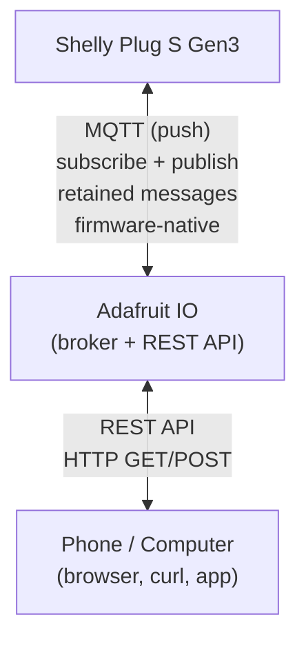

# Shelly Plug S Gen3 — Lightweight Home Automation

## 1. Project vision

A single smart plug that operates autonomously. It works on its own with no connectivity. When wifi is present, it can be controlled locally. When internet is present, it can be controlled remotely — asynchronously, without requiring both sides to be online at the same time.

### Design constraints

- No home server, no hub, no Raspberry Pi, no Docker containers
- No VPN, no Tailscale, no port forwarding
- No backend we host or maintain — only third-party managed services (free tier)
- The plug must work standalone when all connectivity is lost
- Phone (Android, on wifi or cellular) and local computer as control surfaces
- All authentication must be lightweight enough for a constrained ESP32 device

### Design principles

- Autonomous operation: the plug makes decisions based on the information it has
- Async communication: neither side needs to be online at the same time
- Graceful degradation: no wifi → use last known config; no internet → local control still works
- Minimal moving parts: fewer services, fewer dependencies

---

## 2. The device: Shelly Plug S Gen3

### Hardware

- Chip: ESP-Shelly-C38F (ESP32-based)
- Flash: 8 MB (doubled from Plus series)
- Smart plug form factor (EU plug, 16A max)
- Power metering built in
- Physical button on device
- LED indicator

### Scripting environment (mJS)

- Subset of JavaScript (not full ES6)
- Runs on-device, survives reboots if set to "run on startup"
- Access to device APIs: Switch, Input, MQTT, HTTP, KVS, Timer, Shelly events
- KVS (Key-Value Store): persistent storage across reboots — used in previous timer project for schedule persistence
- Event-driven: `Shelly.addEventHandler()` for reacting to input/switch/status changes
- `Shelly.call()` for invoking RPC methods from within scripts
- `Timer.set()` for periodic tasks
- Scripts can coexist — multiple scripts can run simultaneously

### Communication capabilities

**Inbound (device as server — local network only):**
- HTTP REST API on port 80 (RPC-based, JSON)
  - Example: `http://<IP>/rpc/Switch.Set?id=0&on=true`
  - Request size limit: 3072 bytes total (headers + body)
- WebSocket server for persistent local connections
- mDNS announced as `shellyplugsg3-XXXXXXXXXXXX`

**Outbound from scripts:**
- `Shelly.call("HTTP.GET", {url, headers, ssl_ca})` — supports TLS with `ssl_ca: "*"` for public CAs
- `Shelly.call("HTTP.POST", {url, body, headers, content_type})`
- `Shelly.call("HTTP.Request", {method, url, body, headers})` — most flexible
- `MQTT.publish(topic, message, qos, retain)` — from scripts when MQTT is connected

**MQTT client (firmware-level):**
- Configured via device web UI or RPC, not scripting
- Connects to one broker (configured once)
- QoS 0 (at most once) and QoS 1 (at least once) supported
- Retained messages supported
- Auto-reconnect handled by firmware
- mTLS supported: upload ca.crt, client.crt, client.key via RPC methods
- When connected, scripts can publish and the device subscribes to configured topics
- Built-in MQTT features: RPC-over-MQTT, status notifications, component control interface
- Topic prefix configurable (default: device ID based)
- **On Gen2+: MQTT and Shelly Cloud can run simultaneously** (Gen1 was either/or)

**Shelly Cloud (firmware-level):**
- Outbound connection to Shelly's servers, enabled by default
- Automatic, no configuration beyond "enabled: yes"

**Webhooks:**
- Up to 20 hooks per device
- Triggered on events (switch toggle, button press, sensor reading, etc.)
- Support conditions (script expressions) and URL token replacement
- Can call any HTTP(S) endpoint

**Schedules:**
- Built-in cron-like scheduler
- Time-based triggers: date, time of day, weekdays, hours, minutes, seconds
- Sunrise/sunset support (auto-geolocated from public IP)

### Known resource constraints

- Limited RAM (~160-230 KB free depending on what's running)
- mJS is not full JavaScript — limited string handling, no Promises, no async/await
- HTTP responses from outbound calls: body size limited
- MQTT: single broker connection only
- TLS handshakes consume significant resources on ESP32
- Script execution is single-threaded, cooperative

---

## 3. Shelly Cloud — evaluated and excluded from design

### What it is

Free cloud service by Shelly (Allterco). Device connects automatically. Phone app (Shelly Smart Control) for control. Premium tier at €3.99/month adds weather scenes, extended logs, 1-min statistics.

### Cloud Control API (free)

Two communication methods:

**HTTP API:**
- Auth: `auth_key` parameter (obtained from app settings, changes with password)
- Server URI: per-account (e.g., `shelly-49-eu.shelly.cloud`)
- Rate limit: 1 request/second
- Can: get device status, set switch state, control groups of devices
- Cannot: change device settings, store arbitrary data

**WebSocket API:**
- Auth: OAuth2 with JWT tokens, `shelly-diy` as client_id for personal use
- Real-time push events (status changes, power readings)
- Can issue simple control commands
- DIY tokens "MIGHT be subject to rate restrictions"
- Documentation described as "work in progress" and lacking examples

### Why excluded

- **Command-and-control only** — external client sends commands, device obeys
- **No shared state store** — can't post arbitrary JSON config for the device to pull
- **One-directional custom data** — the Shelly script can't read custom config from cloud API
- **Doesn't fit autonomous pattern** — device needs to *fetch* information and decide, not just receive toggle commands
- Architecture mismatch: Shelly Cloud is "remote control," our design is "autonomous agent with async config sync"

### May revisit for

- Quick phone toggle via the Shelly app (free, zero effort)
- Power monitoring dashboards
- As a fallback "dumb remote control" if custom solution is down

---

## 4. Async communication layer — research findings

### The core requirement

A lightweight third-party service that:
1. The Shelly can both read from and write to
2. A phone/computer can both read from and write to
3. Operates asynchronously — messages persist until consumed
4. Requires no infrastructure we maintain
5. Has a free tier sufficient for a single device
6. Auth is lightweight enough for an ESP32

### Protocol comparison: MQTT vs REST

| Aspect | MQTT | REST (HTTP polling) |
|---|---|---|
| Transport | Persistent TCP connection | Request/response per interaction |
| Push delivery | Yes — broker pushes to subscribers | No — client must poll |
| Async (offline delivery) | Retained messages + QoS | Must poll and check for changes |
| Shelly support | Firmware-native, auto-reconnect | Script-based (HTTP.GET in timer loop) |
| Phone client | Needs MQTT app or custom WebSocket page | Any browser, curl, Android app |
| Auth overhead | Username/password at CONNECT (once) | API key per request (header or param) |
| TLS overhead | One handshake, kept alive | Handshake per poll cycle |
| Latency | Near-instant when both online | = poll interval |
| Bandwidth | ~20 bytes per message | Full HTTP overhead per poll |
| Complexity on Shelly | Minimal (firmware handles transport) | Script must manage poll loop, change detection, error handling |

**Key insight: MQTT retained messages are the killer feature for async.** When you publish with `retain=true`, the broker stores the last message on that topic. When a subscriber connects (or reconnects), it immediately receives the retained message — even if the publisher is long gone. This is exactly the "shared clipboard" behavior we want, built into the protocol.

### Candidate services investigated

**HiveMQ Cloud (free tier)**
- 100 device connections (massive overkill for one plug)
- Username/password auth + TLS on port 8883
- Deployed on AWS Frankfurt, Germany — low latency to Norway
- MQTT only — no REST interface on same data
- Public test broker also available (broker.hivemq.com) but no auth, no privacy
- Well-established, enterprise-grade
- No uptime guarantee on free tier, may update/restart instances at any time

**EMQX Cloud**
- Free tier available
- Full MQTT 5.0 support
- Very feature-rich, likely overkill for one plug
- Global and CN access points

**Adafruit IO** ⭐ (leading candidate)
- Free tier: 30 messages/minute, 10 feeds, 30-day data retention
- Auth: username + API key (simple header or MQTT password)
- **Dual protocol: same feeds accessible via both MQTT and REST**
  - Shelly connects via MQTT (native, push, retained)
  - Phone controls via REST HTTP (simple, no app, bookmarkable)
- MQTT broker at `io.adafruit.com`, port 8883 (TLS) or 443 (WebSocket)
  - Username = Adafruit IO username
  - Password = AIO key
- REST API: `https://io.adafruit.com/api/v2/{username}/feeds/{feed}/data`
  - Header: `X-AIO-Key: {key}`
- Feed concept maps to topics — one feed per data channel
- Feeds addressed as `{username}/feeds/{feedkey}` or short form `{username}/f/{feedkey}`
- ~80 bytes to connect, ~20 bytes per pub/sub message
- Dashboard available (web-based, drag-and-drop widgets) — free bonus UI
- Supports QoS 0 and 1
- Connection rate limit: max 20 connection attempts per minute
- Paid tier: $10/month — 60 msg/min, removes feed/dashboard limits, adds email/SMS alerts

**Beebotte**
- Free tier available
- REST + MQTT + WebSocket on same data (triple protocol)
- Channel/Resource hierarchy (channel = device, resource = data point)
- Auth: API key + secret key, HMAC-based for REST — potentially heavier than Adafruit IO
- Less well-known, smaller community, less documentation

**jsonbin.org / jsonbin.io**
- Pure REST key/value JSON store
- Simple API key auth
- No push/MQTT — polling only
- Good for dead-simple "shared clipboard" but no real-time capability
- Best as a fallback or for rarely-changing config data

### Current leaning: Hybrid via Adafruit IO

Adafruit IO uniquely fits because it offers MQTT + REST on the same underlying feeds:

**Why this works:**
- Shelly side: MQTT — firmware-managed connection, auto-reconnect, retained messages, QoS 1, zero scripting for transport
- Phone side: REST — HTTP POST to set desired state, GET to read current state — works from browser, curl, a sideloaded Android app, anything
- Same data, two access methods, zero infrastructure
- Adafruit IO dashboard as a free bonus control panel / status display

**Why not pure MQTT broker (HiveMQ etc.):**
- Phone would need an MQTT client app, or we'd need to build a WebSocket-MQTT bridge page
- Less accessible for quick casual control
- No REST fallback

**Why not pure REST store (jsonbin etc.):**
- No push — Shelly must poll, wasting resources and adding latency
- No retained message equivalent — need to build change detection
- More complex Shelly script

---

## 5. Open questions

### Architecture

- [x] What feed/topic structure do we need? (e.g., `commands`, `status`, `config`, or single combined?)
  > Answered in doc 02 §2: Three feeds — `command`, `config`, `heartbeat` — each with a single purpose and direction.
- [x] Do we need bidirectional status reporting, or just command → ack?
  > Answered in doc 02 §2.3 and doc 03 §4: Heartbeat feed provides device-to-phone status; `ack` field confirms last processed command.
- [x] How does the Shelly script reconcile a new MQTT command with its current autonomous behavior?
  > Answered in doc 05 §5.3: `execute_command()` handles all commands regardless of current state. Staleness check (doc 05 §4.2) prevents delayed commands.
- [x] Message format: flat key-value or nested JSON? (consider mJS parsing limitations and 3072 byte limit)
  > Answered in doc 03 §7: Flat JSON with short keys. Rationale: mJS handles flat objects reliably, short keys save memory.
- [x] How do we handle conflicting commands (e.g., "turn on" arrives while autonomous timer says "turn off")?
  > Resolved: Staleness check (doc 02 §3.7, doc 01 §5.5) discards commands older than 2 min. Fresh commands override current state.
- [x] Do we need command acknowledgment / delivery confirmation beyond MQTT QoS 1?
  > Answered in doc 03 §4.1: Heartbeat `ack` field is sufficient. Phone checks if `ack` matches the last command sent.
- [x] Should config/schedule be a separate feed from instant commands?
  > Answered in doc 02 §2: Yes, `config` is separate from `command`. Config is "desired state" with version gating; commands are instant actions with staleness check.

### Functional requirements (not yet defined)

- [x] What does the plug actually control? (heater, lamp, coffee maker — affects logic)
  > Answered in doc 01 §1: A coffee maker. Countdown timer on every on-state.
- [x] What autonomous behaviors should it have? (timers, schedules, temperature-based, power-based?)
  > Answered in doc 01 §§3-4: Countdown timers (auto-off), one-shot schedule (fire-and-disarm). No temperature/power logic.
- [x] What should be remotely configurable? (schedule, thresholds, mode, on/off?)
  > Answered in doc 03 §3: Schedule (sch, h, m), default duration (dur), max ceiling (max). All via config feed.
- [x] Do we need power monitoring data exposed remotely?
  > Resolved: No. Listed in doc 01 §8 (out of scope) and doc 07 §8 (future consideration).
- [x] What's the phone control UX? (toggle, set schedule, change mode, view status?)
  > Answered in doc 06 §3: Android app with status display, timer buttons (0, -30, +30, 90), schedule toggle and time picker.

### Service validation (Adafruit IO)

- [x] Confirm free tier limits are sufficient — 30 msg/min, 10 feeds, 30-day retention
  > Answered in doc 04 §1.2: Confirmed. 3 of 10 feeds used, peak rate well under 5 msg/min.
- [x] Test: can the Shelly Gen3 connect to Adafruit IO MQTT with TLS? (port 8883, username + AIO key)
  > Answered in doc 04 §6.5: Yes, with `ssl_ca: "ca.pem"`. Validated during Phase 1.
- [x] Test: does Adafruit IO support retained messages properly for our use case?
  > Answered in doc 04 §2: No — Adafruit IO does not support MQTT retain. Workaround: `/get` topic. See decision D04.27.
- [x] Test: can Shelly script subscribe to specific feeds and parse incoming JSON?
  > Answered in doc 04 §6.6: Yes. Validated during Phase 1 with minimal test script.
- [x] What happens when Adafruit IO is unreachable? (firmware MQTT reconnect behavior)
  > Answered in doc 04 §8 and doc 02 §7: Firmware auto-reconnects. Device continues on KVS config. Local control still works.
- [x] Is 30 msg/min enough if we want periodic status reporting + commands?
  > Answered in doc 03 §5 and doc 04 §7: Yes, typical usage is well under 5 msg/min. Worst-case burst analysis done.
- [x] Fallback plan if Adafruit IO changes terms or shuts down?
  > Answered in doc 02 §7 and doc 07 §7.2: Device runs on KVS config indefinitely. Physical button and local HTTP still work. Can migrate to a new broker.

### Local control

- [x] When on same wifi: direct HTTP to Shelly's local API, or still route via cloud broker?
  > Answered in doc 02 §1.2 and doc 06 §4: Direct HTTP. Auto-detect tries local first with 2s timeout, falls back to remote.
- [x] Can we detect "am I local?" and prefer direct control?
  > Answered in doc 06 §4.1: Yes, try local first (2s timeout), fall back to remote. Decision D06.49.
- [x] What does the local control UX look like? (browser bookmark to device IP, simple web page?)
  > Answered in doc 06 §§2-3: Native Android app (primary), HTML fallback page (secondary). Not a simple bookmark — proper app with auto-detect.
- [ ] mDNS discovery: can the phone resolve `shellyplugsg3-XXXX.local`?
  > Partially addressed in doc 06 §4.3: Decision was to use manual IP configuration (D06.50). mDNS discovery deferred as unnecessary given DHCP reservation.

### Edge cases and resilience

- [x] Wifi network change (moving house): how to reconfigure the plug?
  > Answered in doc 07 §4.1: Shelly opens AP mode when wifi not found. Reconfigure via web UI.
- [x] What if the mJS script crashes? (Shelly has watchdog/auto-restart for scripts?)
  > Answered in doc 05 §14 and doc 08 §4: Firmware restarts the script if "run on startup" is enabled. Boots into OFF state (safe).
- [x] What if the MQTT broker is down for days? (device continues on last known config from KVS)
  > Answered in doc 02 §7: Correct — device uses KVS config, timer runs locally, physical button works. No remote control until broker returns.
- [x] Power outage recovery: KVS persists, but what state does the plug resume in?
  > Answered in doc 01 §5.2 and doc 05 §3: Always boots OFF. Timer does not survive reboot. Config loaded from KVS. Decision D05.41.
- [x] Clock sync: NTP required for schedule-based logic — what if NTP unreachable? (previous project used NTP guard)
  > Answered in doc 01 §5.4 and doc 05 §7: Schedule does not fire without NTP (fail-safe). MQTT commands rejected until first NTP sync. Physical button works without NTP.
- [x] Adafruit IO API key rotation: how to update the key on the Shelly remotely?
  > Answered in doc 04 §9.2 and doc 07 §5.1: Cannot be done remotely. Requires local wifi access via `Mqtt.SetConfig`. Decision D04.35.

---

## 6. Background and prior art

### Previous Shelly scripting experience

From earlier project on the Shelly Plug S Gen3:
- Built a custom JavaScript timer script with NTP sync guard
- KVS-backed schedule persistence (survives reboots)
- REST endpoints exposed from the script for local control
- JSON-RPC API usage
- Experience with `Timer.set()`, `Shelly.call()`, `KVS.get/set`
- Familiar with the Shelly web UI for script management and debugging
- Awareness of mJS limitations and workarounds
- Explored Shelly Forge VS Code extension and aioshelly Python library

### Relevant home context

- Currently transitioning homes (sold property, buying new)
- TP-Link Omada SDN network in place (managed switches, AP, router)
- Experience with 4G mobile broadband as temporary internet
- Cost-conscious approach to home automation

---

## 7. Decisions made

| # | Decision | Rationale |
|---|---|---|
| D00.1 | No home server / hub | Simplicity, no maintenance, survives house moves |
| D00.2 | Shelly Cloud excluded from core design | Command/control model doesn't fit autonomous async pattern |
| D00.3 | MQTT as primary device protocol | Firmware-native, push-based, retained messages for async |
| D00.4 | REST as primary phone protocol | No app install, works from browser/curl/shortcuts |
| D00.5 | Hybrid MQTT+REST service needed | Adafruit IO leading candidate — same feeds, both protocols |
| D00.6 | Device operates autonomously | Last known config from KVS, works without any connectivity |

---

## 8. Next steps

1. **Define functional requirements** — what the plug controls and what behaviors we want
2. **Design message/feed structure** — feeds, message format, command vocabulary
3. **Validate Adafruit IO** — test MQTT connection from Shelly, test REST from phone
4. **Design the on-device script** — autonomous logic, MQTT handler, state machine
5. **Design the phone control interface** — Android app, web page, or Adafruit IO dashboard
6. **Build and test**
