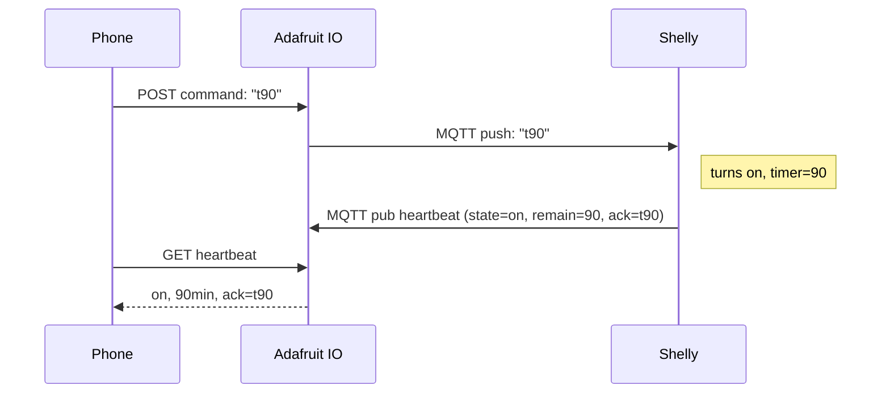
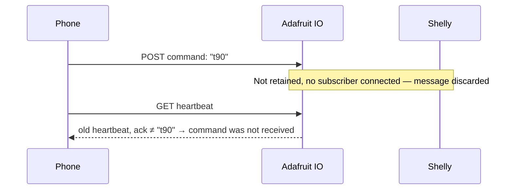
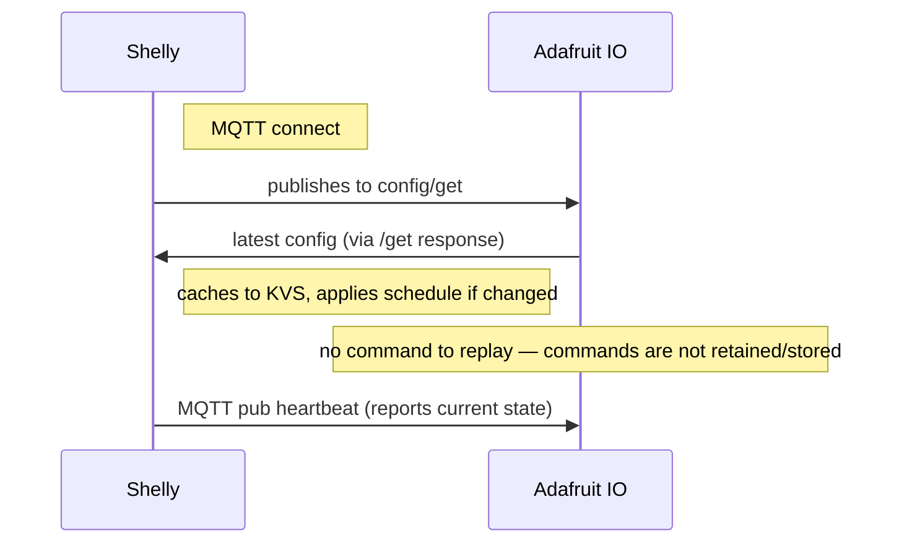
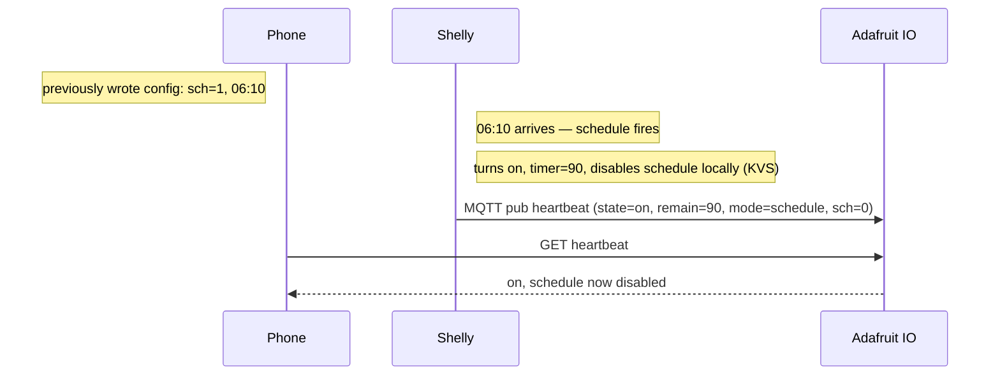
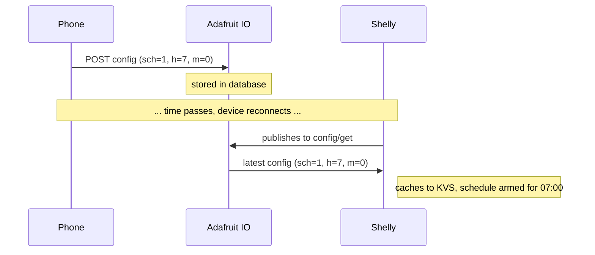
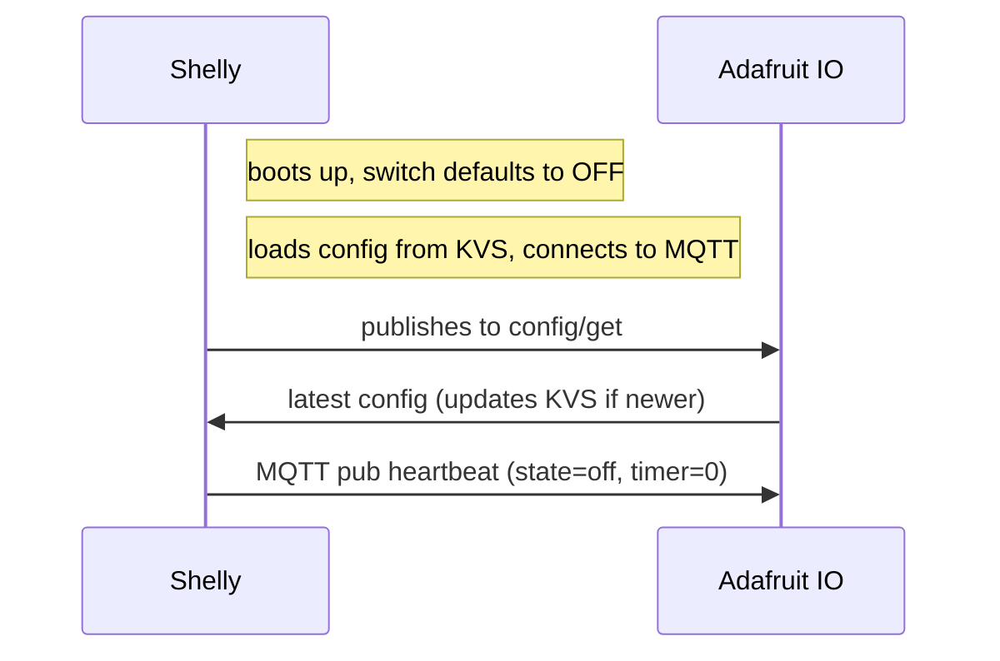
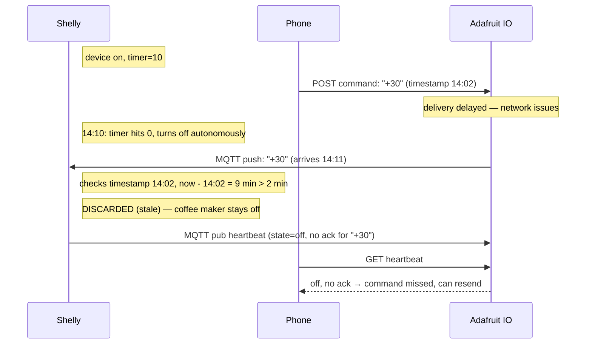
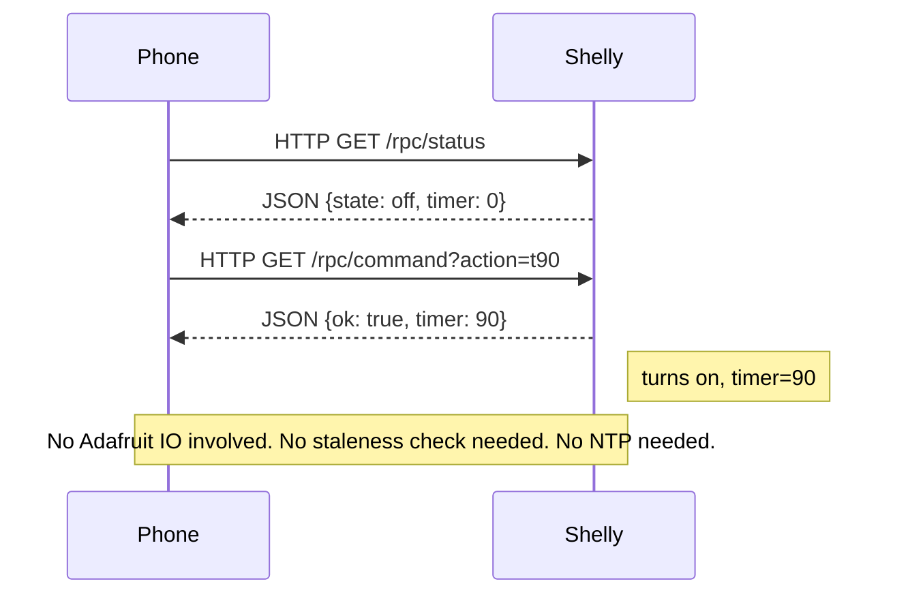

# Shelly Coffee Maker — Communication Architecture

## 1. Overview

The communication layer has two distinct paths:

### 1.1 Remote path (via Adafruit IO)

- **Shelly** speaks MQTT. The firmware handles connection, reconnect, TLS, and subscriptions. The mJS script publishes and reacts to incoming messages.
- **Phone** speaks REST. Plain HTTP requests to Adafruit IO's API. Works from browser, curl, a sideloaded Android app, anything.
- **Adafruit IO** is the bridge. Same underlying data (called "feeds") is accessible via both MQTT and REST. It stores retained messages and serves them to either side on demand.

Neither the phone nor the device talk directly to each other through this path. They communicate by reading and writing to shared feeds, asynchronously.

**This path is inherently asynchronous.** Commands may be delayed by network conditions. The device applies a 2-minute staleness check on all commands received via this path (see section 3.7).

### 1.2 Local path (direct HTTP)

- Phone sends commands directly to the Shelly's built-in HTTP API: `http://<device-ip>/rpc/...`
- Synchronous request/response — no intermediary, no delay, no staleness risk
- Works without internet. Only requires phone and device on the same wifi network.
- Device discoverable via mDNS: `shellyplugsg3-XXXXXXXXXXXX.local`
- Same functional controls as remote (on, off, extend, schedule) — implemented as RPC endpoints exposed by the mJS script
- No Adafruit IO involvement

**This path is synchronous.** No staleness check needed. No NTP dependency for command processing.

---

## 2. Feed structure

Three feeds, each with a single clear purpose and data direction.

### 2.1 `command` — instant actions

| Property | Value |
|---|---|
| **Direction** | Phone → Device |
| **Retained** | No |
| **Protocol (phone side)** | REST POST |
| **Protocol (device side)** | MQTT subscribe |
| **Purpose** | Immediate control actions: on, off, extend, etc. |

**Why not retained:** If the phone sends "turn on" and the device is offline, we do NOT want the device to act on that command minutes or hours later when it reconnects. A stale "on" command at 3 AM is a safety hazard. Commands are fire-and-forget — if the device misses it, the user can see that via the heartbeat (no ack) and resend.

**Staleness check:** Even with non-retained messages, network delays can cause commands to arrive late (e.g., flaky internet queues a message for several minutes). Every command carries a Unix timestamp set by the sender. The device discards any command older than **2 minutes** compared to its own clock. This requires the device to have completed at least one NTP sync since boot.

**What happens when the device is offline:** The command is lost. This is correct behavior. The phone can detect this by checking the heartbeat — if the ack doesn't update, the command wasn't received.

**Before first NTP sync:** The device rejects all commands received via MQTT. It cannot verify timestamps, so it cannot guarantee safety. Local HTTP commands (same wifi) are not affected — they are synchronous and bypass Adafruit IO entirely.

### 2.2 `config` — schedule and thresholds

| Property | Value |
|---|---|
| **Direction** | Phone → Device |
| **Retained** | Conceptually yes (see note) |
| **Protocol (phone side)** | REST POST |
| **Protocol (device side)** | MQTT subscribe |
| **Purpose** | Schedule settings and safety thresholds |

> **Note (updated by doc 04):** Adafruit IO does not support the MQTT retain flag. The equivalent behavior is achieved via the `/get` topic: the device publishes to `{user}/feeds/config/get` on each MQTT connect, and the broker delivers the latest stored value. See doc 04 §2 for details.

**Why "retained" matters here:** Config is "desired state." When the device reboots or reconnects, it should immediately receive the latest config and cache it to KVS. The `/get` mechanism achieves this — the device explicitly requests the latest value on connect, rather than the broker pushing it automatically.

**Ownership:** The phone is the sole writer to this feed. The device never writes to `config`. This avoids write conflicts and keeps a clear authority model — the phone decides what the config is, the device obeys it.

**KVS caching:** On receiving a config message, the device writes it to KVS (persistent on-device storage). If the device reboots without MQTT connectivity, it uses the cached config from KVS. This is the "last known good config" fallback.

### 2.3 `heartbeat` — device status

| Property | Value |
|---|---|
| **Direction** | Device → Phone |
| **Retained** | Conceptually yes (see config note above) |
| **Protocol (device side)** | MQTT publish |
| **Protocol (phone side)** | REST GET |

**Why "retained" matters here:** When the phone checks status, it should see the last known state even if the device is currently offline. The phone reads via REST (`/data/last` endpoint), which returns the latest stored value from Adafruit IO's database regardless of MQTT retain support. This works without broker-level retain.

**What it carries:**
- Current switch state (on/off)
- Remaining timer minutes (if on)
- How the current on-state was triggered (manual, schedule, remote)
- Timestamp of this heartbeat
- Last command acknowledged
- Current schedule state (enabled/disabled, scheduled time)

**Schedule state in heartbeat:** This is how the phone learns that a schedule has fired and auto-disabled. The phone wrote `config` with schedule enabled. Later, the device fires the schedule and disables it locally. The next heartbeat reports `schedule: disabled`. The phone reads this and updates its view. No need for the device to write back to the config feed.

---

## 3. Data flow scenarios

### 3.1 Normal remote on/off

### 3.2 Command while device is offline

### 3.3 Device reconnects after being offline

### 3.4 Schedule fires

### 3.5 Config update while device is offline

### 3.6 Power outage recovery

### 3.7 Stale command rejected

### 3.8 Local control (same wifi, no internet)

---

## 4. Authority model

| Data | Authority (who writes) | Consumer (who reads) |
|---|---|---|
| Commands (remote) | Phone via Adafruit IO REST | Device via MQTT subscribe |
| Commands (local) | Phone via HTTP to device | Device directly (synchronous) |
| Config (schedule, thresholds) | Phone via Adafruit IO REST | Device via MQTT subscribe |
| Device state / heartbeat | Device via MQTT publish | Phone via Adafruit IO REST |
| Device state (local) | Device via HTTP response | Phone via direct HTTP GET |
| Timer countdown | Device (autonomous) | Phone (via heartbeat or local HTTP) |
| Schedule armed/disarmed | Phone sets it, device disarms after firing | Phone reads via heartbeat |
| Safety enforcement | Device (always, locally) | — |
| Staleness enforcement | Device (on MQTT commands only) | — |

The phone never controls the switch directly. It expresses intent ("I'd like this on for 90 minutes"). The device decides whether to honor that, enforces safety caps and staleness checks, and reports what it actually did.

---

## 5. Adafruit IO feed mapping

| Feed key | MQTT topic | REST endpoint | Direction | Retained |
|---|---|---|---|---|
| `command` | `{user}/feeds/command` | `POST /api/v2/{user}/feeds/command/data` | Phone → Device | No |
| `config` | `{user}/feeds/config` | `POST /api/v2/{user}/feeds/config/data` | Phone → Device | Yes |
| `heartbeat` | `{user}/feeds/heartbeat` | `GET /api/v2/{user}/feeds/heartbeat/data?limit=1` | Device → Phone | Yes |

Feeds used: **3 of 10** (free tier). Seven feeds reserved for future use.

---

## 6. Message budget (free tier: 30 messages/minute)

| Source | Action | Frequency | Messages/min |
|---|---|---|---|
| Device | Heartbeat publish | Every 5 min | ~0.2 |
| Device | Heartbeat on state change | On toggle/extend | Burst, rare |
| Phone | Send command | User-initiated | Rare, bursty |
| Phone | Update config | Occasional | Very rare |
| Phone | Read heartbeat | User-initiated | Rare |

**Estimate: well under 5 messages/minute in normal use.** Nowhere near the 30/min limit. Even aggressive polling from the phone (checking heartbeat every 10 seconds) would only add 6/min.

---

## 7. Failure modes

| Scenario | Behavior | Data preserved |
|---|---|---|
| **MQTT broker down** | Device continues on last known config (KVS). Timer runs locally. No remote control. Local HTTP control still works. | Config in KVS, timer in memory |
| **Device loses wifi** | Same as broker down but no local HTTP either. Physical button still works. | Config in KVS, timer in memory |
| **Device power loss** | Reboots into OFF state. Reconnects, receives retained config. | Config in KVS (pre-outage) + retained config from broker |
| **Phone has no internet** | Cannot send remote commands or read heartbeat. Can still control via local HTTP if on same wifi. | Everything on device side |
| **Adafruit IO shuts down** | Device runs on last KVS config indefinitely. Physical button and local HTTP still work. No remote control until a new broker is configured. | Config in KVS |
| **Stale retained config** | Device always uses latest between KVS and incoming MQTT config (compare a version/sequence field) | — |
| **Internet out, wifi up** | Physical button and local HTTP work normally. MQTT disconnected, no remote control, no heartbeat updates. | Config in KVS, timer in memory |
| **Fresh boot, no NTP yet** | Device boots into OFF. Loads config from KVS. Connects to MQTT. Rejects all remote commands until first NTP sync. Schedule does not fire. Physical button and local HTTP work. | Config in KVS |
| **Stale command arrives via MQTT** | Command timestamp compared to device clock. If older than 2 minutes, silently discarded. Heartbeat will not show ack for the discarded command. | — |

---

## 8. Open questions for next layer (message format)

- Exact encoding of commands: short strings vs JSON vs key=value (must include a timestamp field for staleness check)
- Config payload structure: what fields, how to keep it small for mJS parsing
- Heartbeat payload structure: what fields, how often, triggered vs periodic
- Versioning: should config carry a version number so the device can detect "is this newer than what I have in KVS?"
- Acknowledgment: is the `ack` field in heartbeat sufficient, or do we need a dedicated ack mechanism?
- Local HTTP API: exact RPC endpoint names and response format for the mJS script to expose

---

## 9. Design decisions made

| # | Decision | Rationale |
|---|---|---|
| D02.7 | Commands are not retained | Prevents stale commands from activating the coffee maker after reconnect |
| D02.8 | Config is "retained" (latest value available on reconnect via `/get` topic) | Device picks up latest desired config on reconnect. Adafruit IO doesn't support MQTT retain; `/get` achieves the same result (see doc 04 §2) |
| D02.9 | Heartbeat is "retained" (latest value available via REST `/data/last`) | Phone sees last known device state even if device is currently offline. REST reads from database, not MQTT retain |
| D02.10 | Phone is sole authority for config | Clear ownership, no write conflicts |
| D02.11 | Device never writes to command or config feeds | Unidirectional data flow per feed, simple mental model |
| D02.12 | Schedule disarm communicated via heartbeat, not config writeback | Keeps config feed phone-owned; heartbeat is the device's voice |
| D02.13 | 3 feeds used, 7 reserved | Room for future expansion within free tier (10 feeds available) |
| D02.14 | Remote commands carry a timestamp, device discards if older than 2 min | Prevents delayed commands from unexpectedly turning on the coffee maker |
| D02.15 | "NTP synced" = at least one successful sync since boot | ESP32 RTC drift is negligible for a 2-min window; no need for continuous NTP |
| D02.16 | Device rejects all remote (MQTT) commands before first NTP sync | Cannot verify staleness without a clock; fail-safe |
| D02.17 | Local HTTP commands have no staleness check | Synchronous request/response, no intermediary, no delay possible |
| D02.18 | Two control paths: local HTTP (direct) and remote MQTT (via Adafruit IO) | Local works without internet; remote adds convenience when away from home |
