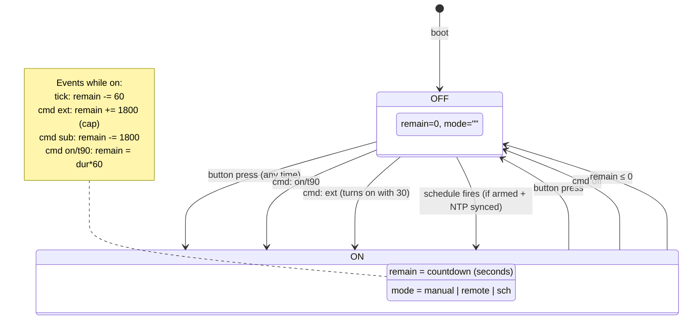

# Shelly Coffee Maker — On-Device State Machine

## 1. Overview

This document describes the mJS script that runs on the Shelly Plug S Gen3. It ties together everything from docs 01–04: the timer and safety rules, the three control paths, the MQTT and HTTP interfaces, config persistence, and the heartbeat reporting.

The script is a single file, running on a cooperative single-threaded mJS runtime. It reacts to events (button press, MQTT message, HTTP request, timer tick) and makes decisions based on in-memory state backed by KVS persistence.

---

## 2. State model

### 2.1 In-memory state (lost on reboot)

These variables exist only in RAM. On reboot, they reset to their defaults. The timer is the most important — a power outage kills the timer, and the plug starts off. This is a safety feature.

| Variable | Type | Default | Description |
|---|---|---|---|
| `sw_on` | boolean | `false` | Current switch state |
| `remain` | number | `0` | Timer remaining in seconds (internal precision; reported as minutes) |
| `mode` | string | `""` | What started the current on-state: `"manual"`, `"remote"`, `"sch"`, or `""` (off) |
| `last_ack` | string | `""` | Last command code successfully processed |
| `ntp_synced` | boolean | `false` | Whether NTP has synced at least once since boot |

### 2.2 KVS-persisted state (survives reboot)

These are stored in the Shelly's Key-Value Store and loaded on boot. They represent the device's "last known good" configuration.

| KVS key | Type | Default | Description |
|---|---|---|---|
| `cfg_v` | number | `0` | Config version (from the `v` field in config messages) |
| `cfg_sch` | number | `0` | Schedule enabled (1) or disabled (0) |
| `cfg_h` | number | `6` | Schedule hour (0–23) |
| `cfg_m` | number | `0` | Schedule minute (0–59) |
| `cfg_dur` | number | `90` | Default on-duration in minutes |
| `cfg_max` | number | `180` | Hard ceiling for timer in minutes |

### 2.3 Derived constants

| Name | Value | Source |
|---|---|---|
| `AIO_USER` | `"your_username"` | Hardcoded on-device (matches MQTT auth). **Do not commit real value to repo** — use placeholder in committed code, replace when pasting to device. |
| `TOPIC_CMD` | `AIO_USER + "/f/command"` | Adafruit IO command feed |
| `TOPIC_CFG` | `AIO_USER + "/f/config"` | Adafruit IO config feed |
| `TOPIC_HB` | `AIO_USER + "/f/heartbeat"` | Adafruit IO heartbeat feed |
| `TOPIC_CFG_GET` | `TOPIC_CFG + "/get"` | Config fetch-on-connect topic |
| `STALE_SEC` | `120` | 2-minute staleness window (seconds) |
| `TICK_SEC` | `60` | Timer tick interval (seconds) |
| `HB_ON_SEC` | `300` | Heartbeat interval while on (5 min) |
| `HB_OFF_SEC` | `900` | Heartbeat interval while off (15 min) |

---

## 3. Boot sequence

On device power-up or reboot, the script runs through this sequence:

```
1.  Load config from KVS (sequentially chained — see §11.1)
      KVS.Get("cfg_v") → cfg_v (default 0 if missing)
      KVS.Get("cfg_sch") → cfg_sch (default 0)
      KVS.Get("cfg_h") → cfg_h (default 6)
      KVS.Get("cfg_m") → cfg_m (default 0)
      KVS.Get("cfg_dur") → cfg_dur (default 90)
      KVS.Get("cfg_max") → cfg_max (default 180)
      Each callback triggers the next load. On completion → boot_complete()

2.  Ensure switch is OFF
      Shelly.call("Switch.Set", {id: 0, on: false})
      (Safety: plug always boots off, regardless of previous state)

3.  Register MQTT subscriptions
      MQTT.subscribe(TOPIC_CMD, on_mqtt_command)
      MQTT.subscribe(TOPIC_CFG, on_mqtt_config)

4.  Start single main loop timer (30s repeating)
      Timer.set(30000, true, main_loop)
      Handles: tick countdown, schedule check, periodic heartbeat, MQTT init

5.  Register combined status handler
      Shelly.addStatusHandler watches for:
        - sys: NTP sync detection (unixtime > 1700000000)
        - mqtt: MQTT connect → fetch config via /get, publish heartbeat
        - switch:0: physical button detection (via script_switching flag)

6.  Register local HTTP endpoints (HTTPServer.registerEndpoint)
      coffee_status  → /script/1/coffee_status
      coffee_command → /script/1/coffee_command

7.  Check if NTP already synced at boot
      (status handler only catches changes, not existing state)
```

**KVS loading is asynchronous and sequentially chained.** Each `KVS.Get()` callback triggers the next load. Parallel calls are avoided because >3 concurrent `Shelly.call()` crashes the runtime (see doc 08 §4.2).

**A single 30-second timer handles all periodic tasks** via counter-based dispatch. The spec originally designed separate timers for tick, heartbeat, and schedule, but the mJS runtime supports only ~4-5 concurrent timers (see doc 08 §4.1). The consolidated approach is both more efficient and more reliable.

**The switch is forced OFF on boot** regardless of what KVS says or what the switch's hardware state is. This implements the power-loss safety rule (doc 01 §5.2): a power interruption kills the session.

---

## 4. Event handlers

### 4.1 Physical button detection

> **Implementation note:** The Plug S Gen3 has no separate Input component. The physical button toggles the switch directly in firmware — there is no `single_push` or `btn_down` event. Both button presses and `Switch.Set` calls fire the same `switch:0` status change. The script uses a `script_switching` flag to distinguish script-initiated changes from physical button presses. See §7 for the status handler implementation.

When a physical button press is detected (status change with `script_switching=false`):

```
if output == true:    (button turned switch ON)
    remain = cfg_dur * 60
    mode = "manual"
    sw_on = true
else:                 (button turned switch OFF)
    remain = 0
    mode = ""
    sw_on = false
last_ack = "btn"
publish_heartbeat()
```

No NTP check. No staleness check. No connectivity required. The physical button always works. The firmware toggles the switch before the script sees the event, so the script only syncs its state variables — it does not need to call `Switch.Set`.

### 4.2 MQTT command — `on_mqtt_command(topic, message)`

Triggered when a message arrives on the command feed from Adafruit IO.

```
on_mqtt_command(topic, message):
  msg = JSON.parse(message)
  if msg is null → return (malformed)

  // Staleness check
  if not ntp_synced → return (cannot verify timestamp)
  now = get_unixtime()
  if now - msg.ts > STALE_SEC → return (stale command)
  if msg.ts > now + STALE_SEC → return (future timestamp, clock skew)

  // Execute
  execute_command(msg.c)
  last_ack = msg.c
  publish_heartbeat()
```

### 4.3 MQTT config — `on_mqtt_config(topic, message)`

Triggered when a message arrives on the config feed (either from a new publish or from a `/get` response).

```
on_mqtt_config(topic, message):
  msg = JSON.parse(message)
  if msg is null → return (malformed)

  // Version check
  if msg.v <= cfg_v → return (stale or duplicate config)

  // Accept new config
  cfg_v = msg.v
  cfg_sch = msg.sch
  cfg_h = msg.h
  cfg_m = msg.m
  cfg_dur = msg.dur
  cfg_max = msg.max

  // Persist to KVS
  KVS.set("cfg_v", cfg_v)
  KVS.set("cfg_sch", cfg_sch)
  KVS.set("cfg_h", cfg_h)
  KVS.set("cfg_m", cfg_m)
  KVS.set("cfg_dur", cfg_dur)
  KVS.set("cfg_max", cfg_max)

  // Enforce max on current timer if it was lowered
  if sw_on and remain > cfg_max * 60:
    remain = cfg_max * 60

  publish_heartbeat()
```

No staleness check on config. Config is "desired state" — it's always valid regardless of when it was written. The version number handles ordering.

### 4.4 MQTT connect — `on_mqtt_connect()`

Triggered when the firmware establishes (or re-establishes) the MQTT connection. Detected via `Shelly.addStatusHandler` watching the `mqtt` component's `connected` status.

```
on_mqtt_connect():
  // Request latest config from Adafruit IO
  MQTT.publish(TOPIC_CFG_GET, "", 0, false)

  // Publish current state so the phone has a fresh snapshot
  publish_heartbeat()
```

Subscriptions are registered once at boot (step 5 in boot sequence). The Shelly firmware maintains them across reconnections — no need to re-subscribe on connect.

### 4.5 Consolidated main loop

> **Implementation note:** The spec originally designed separate timers for tick (60s), heartbeat (variable), and schedule check (30s). The mJS runtime only supports ~4-5 concurrent timers (doc 08 §4.1), so these are consolidated into a single 30-second repeating timer with counter-based dispatch.

```
main_loop():   (runs every 30 seconds)
    // --- Tick countdown (every 2 cycles = 60s) ---
    tick_counter++
    if tick_counter >= 2:
        tick_counter = 0
        if sw_on:
            remain -= 60
            if remain <= 0: turn_off(); publish_heartbeat()

    // --- Heartbeat (counter-based interval) ---
    hb_elapsed += 30
    interval = 300 if sw_on else 900
    if hb_pending OR hb_elapsed >= interval:
        do_publish_heartbeat(false)

    // --- Schedule check (every cycle = 30s) ---
    if cfg_sch == 1 AND ntp_synced AND !sw_on:
        d = new Date()
        if d.getHours() == cfg_h AND d.getMinutes() == cfg_m:
            cfg_sch = 0; KVS.set("cfg_sch", 0)
            turn_on(cfg_dur, "sch")
            publish_heartbeat()

    // --- MQTT init (once, ~30s after boot) ---
    if !mqtt_init_done:
        mqtt_init_done = true
        if MQTT connected: on_mqtt_connect()
```

**30-second check interval** ensures we never miss the schedule minute window. Since we check hour:minute twice per minute, we always catch the target minute.

**Preventing double-fire:** The schedule is disarmed immediately when it fires. Even if the check runs again within the same minute, `cfg_sch` will be 0.

**Timezone:** `new Date().getHours()` / `.getMinutes()` returns local time, DST-aware via the Shelly's configured IANA timezone (e.g., `Europe/Oslo`).

**Timer precision:** The countdown decrements by 60 seconds every 2 cycles. The `remain` value is tracked in seconds internally but reported as minutes via `Math.floor(remain / 60)`.

---

## 5. Core functions

### 5.1 `turn_on(duration_min, new_mode)`

Activates the switch and sets the countdown timer.

```
turn_on(duration_min, new_mode):
  // Enforce ceiling
  if duration_min > cfg_max:
    duration_min = cfg_max

  remain = duration_min * 60   // convert to seconds
  mode = new_mode
  sw_on = true

  script_switching = true
  Shelly.call("Switch.Set", {id: 0, on: true}, callback {
    script_switching = false
  })
```

The `script_switching` flag prevents the status handler from interpreting this `Switch.Set` as a physical button press. See §4.1 and §7.

### 5.2 `turn_off()`

Deactivates the switch and clears the timer.

```
turn_off():
  remain = 0
  mode = ""
  sw_on = false

  script_switching = true
  Shelly.call("Switch.Set", {id: 0, on: false}, callback {
    script_switching = false
  })
```

### 5.3 `execute_command(cmd)`

Processes a command code. Used by both MQTT and local HTTP paths.

```
execute_command(cmd):
  if cmd === "on":
    turn_on(cfg_dur, "remote")

  else if cmd === "t90":
    turn_on(90, "remote")

  else if cmd === "off":
    if sw_on:
      turn_off()

  else if cmd === "ext":
    if sw_on:
      new_remain = remain + 30 * 60
      max_remain = cfg_max * 60
      remain = (new_remain > max_remain) ? max_remain : new_remain
    else:
      turn_on(30, "remote")

  else if cmd === "sub":
    if sw_on:
      remain = remain - 30 * 60
      if remain <= 0:
        turn_off()
```

**Note on `on` vs `t90`:** In the implementation, `on` uses `cfg_dur` (configurable default duration, typically 90) while `t90` always uses a hardcoded 90 minutes. This diverges from the original spec (doc 03 decision D03.25) which stated they were identical. The distinction is intentional: `on` respects the user's configured default, while `t90` is a fixed 90-minute timer regardless of config.

**Note on `ext` while off:** Turns on with 30 minutes, not `cfg_dur`. This matches doc 01 §3.2 — the +30 button while off starts a 30-minute session.

### 5.4 `publish_heartbeat()`

Constructs and publishes the heartbeat JSON to Adafruit IO.

```
publish_heartbeat():
  if not ntp_synced → return (heartbeat needs a timestamp)

  hb = JSON.stringify({
    s: sw_on ? "on" : "off",
    r: Math.floor(remain / 60),
    mode: mode,
    sch: cfg_sch,
    h: cfg_h,
    m: cfg_m,
    ack: last_ack,
    ts: get_unixtime(),
    ntp: true
  })

  MQTT.publish(TOPIC_HB, hb, 1, false)
```

QoS 1 for heartbeats — we want at-least-once delivery since this is the phone's primary view of device state.

The `false` in the publish call is the retain flag. Even though it has no effect on Adafruit IO (they don't support retain), we pass `false` to be explicit.

### 5.5 `get_unixtime()`

Returns the current Unix epoch time in seconds.

```
get_unixtime():
  return Shelly.getComponentStatus("sys").unixtime
```

`Shelly.getComponentStatus("sys")` returns an object that includes `unixtime` (seconds since epoch) when NTP is synced. Before NTP sync, this value may be 0 or unreliable — which is why `ntp_synced` gates all time-dependent operations.

### 5.6 `get_localtime()`

Returns the current local time as hour and minute, respecting the device's configured timezone.

```
get_localtime():
  let status = Shelly.getComponentStatus("sys")
  // The Shelly provides local_time as "HH:MM" string when timezone is configured
  // Alternatively, use unixtime + timezone offset
  // Exact API depends on firmware version — validate during testing
```

**Open question:** The exact API for getting timezone-aware local hour/minute in mJS needs to be confirmed during development. `Sys.GetStatus` includes a `time` field in some firmware versions. Worst case, we can compute it from `unixtime` + a timezone offset stored in config, but the firmware should handle this natively since the device has a configured timezone via `Sys.SetConfig`.

---

## 6. Local HTTP endpoints

The mJS script registers custom HTTP endpoints via `HTTPServer.registerEndpoint()` that the phone (on the same wifi) calls directly via HTTP GET.

> **Note:** The originally assumed `Shelly.addRPCHandler()` API does not exist. `HTTPServer.registerEndpoint()` is the correct API (validated 2026-03-21 on firmware 1.7.5). URL pattern is `/script/<script_id>/<endpoint>` instead of `/rpc/Coffee.*`. Max 5 endpoints per script, 3072-byte request limit, 10-second response timeout.

### 6.1 `coffee_command`

**Request:** `GET /script/1/coffee_command?cmd=t90`

**Handler:**

```
HTTPServer.registerEndpoint("coffee_command", function(req, res) {
  let cmd = get_query_param(req.query, "cmd")
  if not cmd:
    res.code = 400
    res.body = JSON.stringify({ok: false, error: "missing cmd"})
    res.headers = [["Content-Type", "application/json"]]
    res.send()
    return

  let valid = ["on", "off", "ext", "sub", "t90"]
  if valid.indexOf(cmd) < 0:
    res.code = 400
    res.body = JSON.stringify({ok: false, error: "unknown command"})
    res.headers = [["Content-Type", "application/json"]]
    res.send()
    return

  execute_command(cmd)
  last_ack = cmd
  publish_heartbeat()

  res.code = 200
  res.headers = [["Content-Type", "application/json"]]
  res.body = JSON.stringify({
    ok: true,
    state: sw_on ? "on" : "off",
    remaining: Math.floor(remain / 60),
    ack: cmd
  })
  res.send()
})
```

**No staleness check.** Local HTTP is synchronous — there is no intermediary that could delay the command. No NTP dependency for command processing.

**Response:**

```json
{"ok":true,"state":"on","remaining":90,"ack":"t90"}
```

### 6.2 `coffee_status`

**Request:** `GET /script/1/coffee_status`

**Handler:**

```
HTTPServer.registerEndpoint("coffee_status", function(req, res) {
  res.code = 200
  res.headers = [["Content-Type", "application/json"]]
  res.body = JSON.stringify({
    state: sw_on ? "on" : "off",
    remaining: Math.floor(remain / 60),
    mode: mode,
    sch: cfg_sch,
    h: cfg_h,
    m: cfg_m,
    ntp: ntp_synced,
    ts: ntp_synced ? get_unixtime() : 0
  })
  res.send()
})
```

Same fields as the heartbeat, delivered synchronously. This is how the phone gets status when on the same wifi without going through Adafruit IO.

---

## 7. NTP sync detection

The Shelly firmware syncs NTP automatically when internet is available. The script detects this via the status handler:

```
Shelly.addStatusHandler(function(event) {
  // Detect NTP sync
  if event.component === "sys" and event.delta.unixtime is defined:
    if event.delta.unixtime > 1700000000:   // sanity check: after ~Nov 2023
      ntp_synced = true

  // Detect MQTT connect
  if event.component === "mqtt" and event.delta.connected === true:
    on_mqtt_connect()
})
```

The `unixtime > 1700000000` check prevents false positives from the RTC reporting a near-zero value before actual NTP sync.

**Once set, `ntp_synced` stays true for the rest of the session.** Per doc 01 §5.4, a single successful sync is sufficient — the ESP32 RTC drifts by seconds per day, which is irrelevant for a 2-minute staleness window.

---

## 8. Timer precision and the tick model

### 8.1 Why 60-second ticks

The timer counts down in 60-second intervals. This means:

- Worst-case latency from "timer hits 0" to "switch turns off" is 60 seconds
- For a coffee maker safety timer, 60-second granularity is more than sufficient
- Saves CPU/memory vs a 1-second tick (mJS is cooperative, and each timer wake-up has overhead)

### 8.2 Internal seconds, reported minutes

The timer internally tracks `remain` in seconds for two reasons:

1. Subtraction is cleaner: `remain -= 60` per tick, `remain -= 30 * 60` for `sub` command
2. Future flexibility: if we ever want finer-grained reporting, the internal state supports it

The heartbeat reports `Math.floor(remain / 60)` — always whole minutes, rounding down. This means a heartbeat might show "89 min" one second after a 90-minute timer starts, which is fine. The phone displays "89 min remaining" and the user understands this is approximate.

### 8.3 Turn-off happens at the tick boundary

When `remain` goes to 0 or below, the turn-off happens at the next tick. This means the coffee maker might run up to 59 seconds past the nominal timer value. For a 90-minute or 180-minute timer, this is negligible.

---

## 9. Heartbeat publishing strategy

### 9.1 Event-triggered heartbeats

These publish immediately when something happens:

| Trigger | Why |
|---|---|
| State change (on↔off) | Phone needs to know ASAP |
| Command processed (MQTT or local) | Updates `ack` field |
| Config received | Updates schedule fields |
| Schedule fires | Updates `sch` and state |
| MQTT connect/reconnect | Fresh snapshot after connectivity gap |

### 9.2 Periodic heartbeats

| State | Interval | Purpose |
|---|---|---|
| On | Every 5 min | Keeps `r` (remaining) reasonably current |
| Off | Every 15 min | "I'm alive" — updates `ts` for last-seen |

### 9.3 Debounce with pending flush

Multiple triggers can fire close together (e.g., command processed + state change). To avoid publishing 3 heartbeats in one second, the implementation uses a 2-second debounce with a `hb_pending` flag:

```
do_publish_heartbeat(force):
    if !ntp_synced: return
    if !force AND (now - hb_last_ts < 2):
        hb_pending = true       ← mark for later flush
        return
    hb_pending = false
    hb_last_ts = now
    MQTT.publish(heartbeat)
    hb_elapsed = 0
```

The `hb_pending` flag is checked in the main_loop (every 30s). If set, the deferred heartbeat is flushed, ensuring no state change goes unreported for more than 30 seconds.

The `force` parameter (used by the MQTT-connect heartbeat via `do_publish_heartbeat(true)`) bypasses the debounce — this ensures a fresh snapshot is published after reconnection.

---

## 10. Config processing details

### 10.1 Config arrives via MQTT

When the phone writes a new config to Adafruit IO, the device receives it on the config topic. The handler:

1. Parses JSON
2. Compares `v` to stored `cfg_v`
3. If newer: accepts, persists all fields to KVS
4. If `cfg_max` was lowered and the current timer exceeds it: clamps `remain`

### 10.2 Config arrives via `/get` on connect

Same handler, same logic. The `/get` response delivers the most recent config value from Adafruit IO's database, which is indistinguishable from a live publish.

### 10.3 Config on fresh boot (no MQTT)

If the device boots without internet (wifi only, or no wifi), it loads config from KVS. This is the "last known good" configuration. The schedule and safety limits work offline using these cached values.

### 10.4 What the device never does

- The device never writes to the config feed. Config is phone-owned (doc 02 decision D02.10).
- The device never increments `cfg_v`. Only the phone manages the version counter.
- The device modifies `cfg_sch` locally (sets it to 0 when the schedule fires) but only in KVS, not on the config feed. The heartbeat reports the local state.

---

## 11. mJS implementation considerations

### 11.1 KVS loading is asynchronous

Every `KVS.Get(key, callback)` is async. The boot sequence chains them sequentially to avoid the "too many calls in progress" crash (see doc 08 §4.2). Pattern:

```javascript
let kvs_keys = ["cfg_v", "cfg_sch", "cfg_h", "cfg_m", "cfg_dur", "cfg_max"];
let kvs_idx = 0;

function load_next_kvs() {
  if (kvs_idx >= kvs_keys.length) {
    boot_complete();
    return;
  }
  let key = kvs_keys[kvs_idx];
  kvs_idx = kvs_idx + 1;
  Shelly.call("KVS.Get", {key: key}, function(res, err) {
    set_kvs_val(key, res ? res.value : null);
    load_next_kvs();
  });
}
```

Each callback triggers the next load. When all keys are loaded, `boot_complete()` registers event handlers, starts the timer, and ensures the switch is off.

**Similarly, KVS saves use a sequential queue** (`save_queue` + `save_next()`) to avoid concurrent `Shelly.call()` crashes when multiple config values change at once.

### 11.2 JSON.parse safety

mJS `JSON.parse()` returns `undefined` (not `null`) on failure in some mJS versions. Always check:

```javascript
let msg = JSON.parse(payload);
if (typeof msg !== "object" || msg === null) return;
```

### 11.3 String comparison in mJS

mJS does not have `Array.indexOf()` in all builds. For command validation, use chained `if/else if` rather than array lookup:

```javascript
if (cmd === "on" || cmd === "t90" || cmd === "off" || cmd === "ext" || cmd === "sub") {
  // valid
}
```

### 11.4 Memory budget

The script's global variables, function closures, and parsed JSON objects all consume RAM from the ~200 KB available. Keeping payloads small (short keys, flat JSON) is why doc 03 made those encoding decisions.

**Avoid holding multiple parsed JSON objects simultaneously.** Parse the incoming message, extract what you need into local variables, and let the parsed object go out of scope.

### 11.5 Timer.set behavior

- `Timer.set(ms, repeat, callback)` — `repeat=true` for periodic, `false` for one-shot
- Timers survive across iterations of the event loop but not across script restarts
- The callback receives no arguments
- Creating many timers consumes resources — prefer a single tick timer over per-feature timers where practical

### 11.6 MQTT.publish when disconnected

If the MQTT connection is down, `MQTT.publish()` silently fails (returns false). The script should not crash or accumulate unsent messages. Heartbeats are best-effort — if MQTT is down, the phone won't see updates, and the device continues operating autonomously.

### 11.7 Shelly.call callback pattern

`Shelly.call("Switch.Set", {id: 0, on: true}, callback)` — the callback is optional. For safety-critical calls (turning the switch on/off), consider adding a callback to verify the switch actually changed state. However, in practice, the Shelly's internal switch control is highly reliable and adding callbacks increases complexity.

---

## 12. State transition diagram



---

## 13. Complete event flow examples

### 13.1 Morning schedule with extend

```
05:55  Boot complete, config loaded from KVS (sch=1, h=6, m=10)
06:00  NTP syncs. ntp_synced = true
06:10  schedule_check: hour=6, min=10, sch=1 → fires
         cfg_sch = 0, KVS.set("cfg_sch", 0)
         turn_on(90, "sch") → remain=5400, sw_on=true, mode="sch"
         heartbeat published: s=on, r=90, mode=sch, sch=0
06:15  heartbeat timer → publish (r=85)
...
07:10  heartbeat timer → publish (r=30)
07:15  MQTT command arrives: {"c":"ext","ts":1711036500}
         staleness: now - ts = 3 sec → OK
         remain = 1800 + 1800 = 3600 (60 min)
         ack = "ext"
         heartbeat published: s=on, r=60, ack=ext
07:40  tick → remain = 60*60 - 25*60 = 2100 (35 min)
...
08:15  tick → remain ≤ 0 → turn_off()
         heartbeat published: s=off, r=0
```

### 13.2 Stale command rejected

```
14:00  Device on, remain = 600 (10 min)
14:02  Phone sends {"c":"ext","ts":1711036920} (intent: extend)
       Internet flaky — message queued at Adafruit IO
14:10  tick → remain ≤ 0 → turn_off()
         heartbeat: s=off
14:11  MQTT delivers the ext command (ts=1711036920)
         now = 1711037460, delta = 540 sec > 120 → STALE, discarded
         Coffee maker stays off ✓
```

### 13.3 Local control while MQTT is down

```
Internet goes down. MQTT disconnected.
Device is off, config in KVS, schedule armed.

User on same wifi:
  GET http://192.168.1.xxx/script/1/coffee_command?cmd=t90
  → 200 {"ok":true,"state":"on","remaining":90,"ack":"t90"}
  Device turns on, timer counting down locally.

  GET http://192.168.1.xxx/script/1/coffee_status
  → 200 {"state":"on","remaining":85,"mode":"remote","sch":1,"h":6,"m":10,"ntp":false,"ts":0}

  Note: ntp=false because internet is down and NTP hasn't synced.
  Timer still counts down. Physical button still works.
  No heartbeat published (MQTT down).

Internet returns:
  MQTT reconnects → on_mqtt_connect()
  → publishes config/get, receives config, publishes heartbeat
  Phone can now see the device state again.
```

---

## 14. Error handling

| Error | Handling |
|---|---|
| Malformed MQTT command JSON | `JSON.parse` returns non-object → silently ignored |
| Malformed MQTT config JSON | Same — silently ignored, KVS config unchanged |
| Unknown command code | Ignored (no `execute_command` match). No ack published. |
| MQTT publish fails (disconnected) | `MQTT.publish` returns false. No retry. Heartbeat lost. Device continues. |
| KVS.get fails on boot | Use default value. Device operates with defaults until config arrives via MQTT. |
| KVS.set fails | Config not persisted. Survives until reboot, then reverts to previously-persisted value. Not critical for single session. |
| Switch.Set fails | Extremely unlikely (firmware-internal). Could add callback to detect and retry. Defer for now. |
| Script crash/exception | Shelly firmware restarts the script automatically if "run on startup" is enabled. Device reboots into off state (safe). |

---

## 15. Decisions made

| # | Decision | Rationale |
|---|---|---|
| D05.36 | Timer counts in seconds internally, reports minutes externally | Cleaner arithmetic; future-proof for finer reporting if needed |
| D05.37 | Single 30-second main loop timer handles tick, heartbeat, and schedule | mJS limits ~4-5 concurrent timers; counter-based dispatch avoids crashes (see doc 08 §4.1) |
| D05.38 | Heartbeat interval via elapsed-time counter (300s on, 900s off) | Counter-based within main loop; `hb_pending` flag flushes deferred heartbeats |
| D05.39 | Schedule checker runs every 30 seconds | Ensures we never miss the target minute; negligible CPU cost |
| D05.40 | Heartbeat debounce: 2-second cooldown after publishing | Prevents burst of heartbeats when multiple events fire simultaneously |
| D05.41 | Boot always forces switch OFF | Power-loss safety (doc 01 §5.2); no timer state survives reboot |
| D05.42 | KVS loading uses sequential chaining pattern | mJS has no promises; each callback triggers the next load to avoid concurrent call crashes |
| D05.43 | Local HTTP commands have no staleness check and no NTP dependency | Synchronous path — no intermediary, no delay possible (doc 01 §5.4, doc 02 decision D02.17) |
| D05.44 | Config version comparison is strictly greater-than | Prevents replaying old config; phone must always increment `v` |
| D05.45 | `ntp_synced` is one-way (false → true, never back to false) | Per doc 01 §5.4: single sync is sufficient for session lifetime |
| D05.46 | Script uses short `/f/` topic form for all Adafruit IO topics | Saves bytes on every MQTT operation; meaningful on constrained device (doc 04 decision D04.33) |

---

## 16. Open items for implementation

All items resolved during Phase 2 implementation:

- [x] ~~Confirm `Shelly.getComponentStatus("sys").unixtime` availability~~ — works; returns 0 before NTP sync, valid epoch after
- [x] ~~Confirm timezone-aware local time in mJS~~ — `new Date().getHours()/getMinutes()` works, DST-aware via IANA tz
- [x] ~~Test `MQTT.subscribe()` persistence across reconnects~~ — firmware re-subscribes automatically
- [x] ~~Test `Shelly.addRPCHandler()`~~ — does not exist. Use `HTTPServer.registerEndpoint()` instead
- [x] ~~Measure RAM usage~~ — script uses ~4-6 KB, with ~4 KB free (see `Script.GetStatus` mem_used/mem_free)
- [x] ~~Test KVS.Get when key doesn't exist~~ — callback receives `res` with no `value` field; defaults used
- [x] ~~Test `Shelly.addStatusHandler` for NTP~~ — fires on `sys` component with `delta.unixtime`; also check at boot
- [x] ~~Test script auto-restart~~ — firmware restarts script automatically with "run on startup" enabled
- [x] ~~Write the mJS script~~ — `device/coffee.js` implements the full state machine
