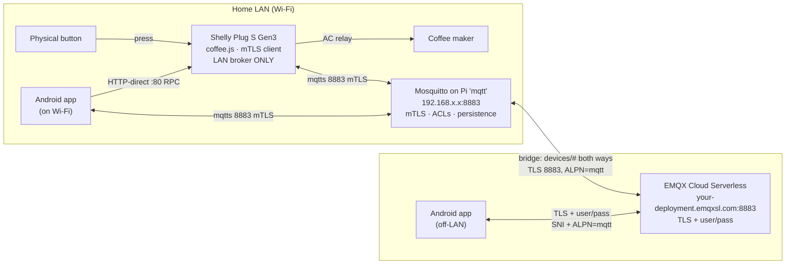
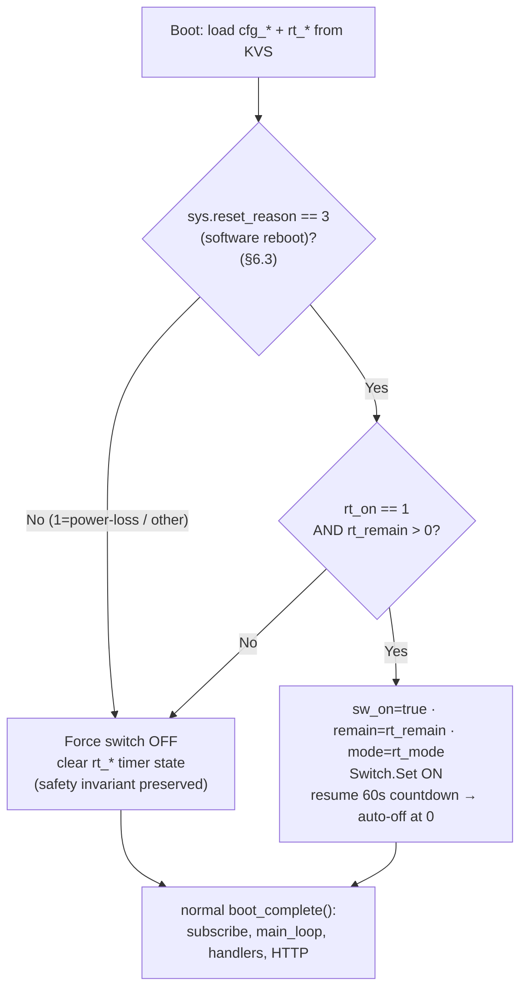

# 11 — Local-MQTT Re-Architecture + Connectivity Watchdog

> **Status:** ✅ IMPLEMENTED & HARDWARE-VERIFIED (2026-06-06). **Design date:** 2026-06-05.
> Supersedes the Adafruit IO transport (docs 02 §1, 04 — archived). The Adafruit feeds, REST polling,
> and the `/get` retain-workaround were **removed** (rip-and-replace), not kept as a fallback.
>
> **What does NOT change:** the timer/countdown model, the 180-min cap, schedule fire-and-disarm,
> the staleness check, command codes, and JSON payload shapes (docs 01, 03, 05). Only the
> **transport, topics, auth, boot/resume, and a new connectivity watchdog** change.

This document is the blueprint for migrating `device/coffee.js` and the Android app off **Adafruit IO**
onto the **hybrid MQTT stack** (local Mosquitto on the Pi `mqtt`, bridged to EMQX Cloud
Serverless), and for adding a **connectivity watchdog with state-resume across reboot**.

**Source material:** the broker operator provides the onboarding/porting material (identities, auth,
topics, connection params) and the hybrid-MQTT design rationale; monitoring is a separate
(planning-stage) concern owned outside this repo. This doc is self-contained — everything the
coffee-timer needs is captured here.

---

## 1. Scope & decisions at a glance

| Concern | v1.x (Adafruit) | v2 (local MQTT) | Decision |
|---|---|---|---|
| Device broker | Adafruit IO cloud MQTT | **Local Mosquitto on Pi, mTLS, LAN only** | D11.59 |
| Device cloud access | (cloud was the only path) | **None** — device never talks to cloud | D11.60 |
| Phone broker | Adafruit REST | **Local (mTLS) + cloud (user/pass) failover** | D11.61 |
| Retain | unsupported → `/get` + REST `/data/last` | **native MQTT retain** (drop both workarounds) | D11.62 |
| Device auth | AIO username in topic | **mTLS client cert (CN = device id)** | D11.63 |
| HTTP-direct local path | kept | **kept — HARD REQ:** phone-over-Wi-Fi must always work | D11.64 |
| Reboot behaviour | always boot OFF (safety) | **watchdog reboot resumes timer; power loss still OFF** | D11.65 |
| Connectivity watchdog | none | **reboot on Wi-Fi loss (short) or broker loss (long); gated on Q1** | D11.66 |
| Monitoring | none | device **emits** `alive` + `online`; all thresholds/alerting external | D11.67 |

Device id (single constant, replaces `AIO_USER`): **`YOUR_DEVICE_ID`**.

---

## 2. Topology



- **Device** = local broker only. It is simply **offline** while the Pi/broker is down (e.g. the
  nightly 02:00 apt-upgrade + 04:00 reboot). Its safety invariants never depend on MQTT.
- **Phone** carries a **broker list**: try local (mTLS) on Wi-Fi, fall back to cloud (user/pass)
  off-LAN. Cloud control reaches the device over the bridge (cloud → EMQX → bridge → Mosquitto →
  device); requires the Pi + bridge + internet.

---

## 3. Identities, auth & credentials

| Identity (CN / username) | Role | Local (mTLS) | Cloud (user/pass) | Key/secret lives |
|---|---|---|---|---|
| `YOUR_DEVICE_ID` | the coffee-timer device | ✅ client cert | — (never cloud) | LAN key → on device; cert in operator's `pki/issued/` |
| `YOUR_PHONE_ID` | the controller phone | ✅ client cert | ✅ username/password | LAN key → Android KeyStore; cloud pw in Bitwarden |

- LAN identity = the **cert CN** (`use_identity_as_username` on Mosquitto). Cloud identity = the
  **username**. They are equal so one mental model covers both.
- **Credentials are provisioned by the operator** (offline CA, vault-gated). The coffee-timer devs
  **consume** them; do not re-issue. Obtain over a secure channel; store under `private/` (gitignored).
- After installing a key on its device, **delete the local key copy** from `private/` (CA-regenerable).

### 3.1 Connection parameters

| | Local (Mosquitto, Pi) | Cloud (EMQX Serverless) |
|---|---|---|
| Host | `192.168.x.x` / `mqtt.local` | `your-deployment.emqxsl.com` |
| Port | `8883` (mqtts) | `8883` (mqtts) or `8084` (wss) |
| TLS trust | **private** CA (bundle `ca.crt`) | **public** CA (system trust store) |
| Client auth | **mTLS client cert** (CN = identity) | **username + password** |
| SNI / ALPN | not required | **required**: SNI = host, **ALPN = `mqtt`** |
| Used by | device + phone-on-Wi-Fi | phone-off-LAN only |

---

## 4. Topic scheme (replaces the Adafruit feeds)

The app/control channels live under **`devices/YOUR_DEVICE_ID/<channel>`**; the Shelly's MQTT
`topic_prefix` is set to `devices/YOUR_DEVICE_ID`, so its built-in `online`/status topics land in
that subtree. The **infra liveness signal lives under a separate top-level `mon/` root**
(`mon/YOUR_DEVICE_ID/alive`) — outside `topic_prefix`. **ACL** (operator-deployed): the device needs
`readwrite devices/YOUR_DEVICE_ID/#` **and** `mon/YOUR_DEVICE_ID/#`; the phone has wider
`devices/#`.

| Adafruit feed (old) | local topic (new) | Dir | Retain | Notes |
|---|---|---|---|---|
| `{user}/f/command` | `devices/YOUR_DEVICE_ID/command` | phone → device | **NO** | safety: never replay a stale "on"; staleness check stays |
| `{user}/f/config` | `devices/YOUR_DEVICE_ID/config` | phone → device | **YES** | device gets latest config on every (re)connect — **drop the `/get` workaround** |
| `{user}/f/heartbeat` | `devices/YOUR_DEVICE_ID/heartbeat` | device → phone | **YES** | app's "last seen" — **drop REST `/data/last`**; phone gets last HB on subscribe |
| — (new) | **`mon/YOUR_DEVICE_ID/alive`** | device → monitor | **NO** | infra liveness; **payload irrelevant** (no uptime/reboot field); fixed timer; NTP-independent; **absolute topic** (outside `topic_prefix`) |
| — (new, automatic) | `devices/YOUR_DEVICE_ID/online` | device → all | YES | Shelly **built-in LWT** — no script code, just `topic_prefix`. Independent of `status_ntf` (verified 2026-06-06: LWT still published with `status_ntf:false`). |

**Payload formats are unchanged** (command/config/heartbeat JSON, the `ts` timestamp field, short
keys — doc 03). Only transport, topic, retain flag, and auth change.

> **✅ `mon/` ACL deployed & verified on the live broker (2026-06-05) — gate cleared, wire up `alive`
> now.** The operator tested enforcement with the real `YOUR_DEVICE_ID` cert (3/3): it can pub/sub
> its own `mon/YOUR_DEVICE_ID/#`, and is denied any other device's `mon/#` (least-privilege). The
> bridge and ACLs remain operator-side — do not touch. If you ever hit an ACL rejection, the operator
> re-proves the grant with `scripts\verify-mon-acl.ps1`.

### 4.1 App "last seen" vs. infra monitoring — kept separate

Two different consumers, deliberately **not** folded onto one topic:

- **App (functional):** renders the retained `heartbeat`'s `ts` as "last seen". No alerting. Does
  **not** subscribe to `alive`/`online`.
- **Monitor (infra):** consumes the **non-retained** `mon/<id>/alive` (pure topic-staleness via
  `expire_after`; **payload irrelevant — no uptime/reboot field**) and the retained `online` (LWT). A
  **retained heartbeat would break** the monitor's staleness — the broker replays the last payload on
  monitor restart and resurrects a dead device to "online" (HA #148860). Hence the monitor gets its own
  non-retained `alive`, not the heartbeat.

**Scope boundary:** the device only **emits** `alive` (+ the automatic `online` LWT). Every threshold,
all detection, and all alerting live in the **external monitor** — out of scope for this repo. Do not
build any monitoring logic into the device. (Monitoring is a separate, planning-stage concern owned outside this repo.)

> **Note:** the earlier "uptime > ~25h = didn't reboot" concern is now moot — the maintainer dropped
> the uptime/reboot field entirely; liveness is pure topic-staleness on `mon/<id>/alive`. The monitor
> profiles this plug as **`reboot_expectation: none`** (watchdog reboots are healthy, not alertable).
> (Closes the earlier Q3.)

---

## 5. Device script changes — `device/coffee.js`

The application logic stays. The changes are transport, retain flags, the device-id constant, and the
new watchdog/resume (§6).

1. **Provision certs** (operator-supplied, via RPC, then reboot):
   ```
   Shelly.PutUserCA        { "data": "<ca.crt PEM>",                          "append": false }
   Shelly.PutTLSClientCert { "data": "<YOUR_DEVICE_ID.crt PEM>",           "append": false }
   Shelly.PutTLSClientKey  { "data": "<YOUR_DEVICE_ID.key, PKCS#8 plain>", "append": false }
   ```
2. **Point MQTT at the local broker with mTLS** (replaces the Adafruit `Mqtt.SetConfig`):
   ```
   Mqtt.SetConfig { "config": {
     "enable": true,
     "server": "192.168.x.x:8883",
     "ssl_ca": "user_ca.pem",
     "use_client_cert": true,
     "client_id": "YOUR_DEVICE_ID",
     "topic_prefix": "devices/YOUR_DEVICE_ID",
     "rpc_ntf": false, "status_ntf": false
   }}
   ```
   Cert **CN must equal `YOUR_DEVICE_ID`** (matches the ACL). Key must be unencrypted PKCS#8.
   **Set `client_id` explicitly** (don't inherit the old Adafruit `shelly-coffee` id): a unique id per
   broker avoids any "already connected, closing old connection" takeover if the generic id is reused.

   > ⚠️ **Known Shelly issue — MQTT-over-TLS + a running script can be unstable.** Multiple community
   > reports (incl. Plug S Gen3 with a self-signed CA) describe frequent reconnects / failure to
   > reconnect when a script runs alongside MQTT-TLS. The mJS `MQTT.*` API shares the device's single
   > built-in connection (it does NOT open a second client), so this is a firmware-level TLS-stability
   > issue, not duplicate clients. Mitigations to validate during a **quiet** session (no reboots):
   > keep firmware current, set a stable `client_id` + sane keepalive, and minimise script MQTT churn.
   > See [`../archive/HW-VALIDATION-v2.md`](../archive/HW-VALIDATION-v2.md) for the field observation + analysis.
3. **In the script:**
   - Replace `AIO_USER`/`TOPIC_*` with `let DEVICE = "YOUR_DEVICE_ID";`. App/control topics are
     `"devices/" + DEVICE + "/command"`, `.../config`, `.../heartbeat`. The liveness topic is the
     **separate** `"mon/" + DEVICE + "/alive"` (top-level `mon/` root, not under `devices/`).
   - Subscribe `command` + `config`. Publish `heartbeat` with **`retain=true`**
     (current code uses `false` — change the 4th arg of `MQTT.publish(TOPIC_HB, hb, 1, false)`).
   - **Delete** the `TOPIC_CFG_GET` logic in `on_mqtt_connect` — config is retained now.
   - Keep the staleness check, command codes, debounce, and the `script_switching` button handling
     exactly as-is.
4. **Emit `alive` for the monitor:** in `main_loop`, every 60 s (every 2 cycles) publish to the
   **absolute** topic `mon/YOUR_DEVICE_ID/alive` **non-retained**. **Payload is irrelevant** (e.g.
   `"1"`) — no uptime/reboot field. **Publish regardless of NTP** — liveness must not depend on the
   clock (unlike `heartbeat`, which gates on `ntp_synced`).
   - ✅ **ACL gate cleared:** the `mon/YOUR_DEVICE_ID/#` grant is deployed & verified on the live
     broker (2026-06-05) — no longer blocked.
5. **`online` LWT is automatic** — keep `status_ntf:false`/`rpc_ntf:false` (as v1). The LWT does
   **not** depend on them (verified 2026-06-06). **Do not** set `status_ntf:true`: it makes the
   firmware publish its full `devices/<id>/status/#` tree — `switch:0` power metering every few
   seconds — which the bridge mirrors to EMQX and burns the free-tier quota the `mon/` split exists
   to protect. Our script publishes its own `heartbeat`/`alive`; the firmware status tree is unused.

> The HTTP-direct local path (port 80 RPC: `coffee_status` / `coffee_command`) is **kept unchanged**
> (D11.64) — this is a **hard requirement**: phone control over Wi-Fi must *always* be possible,
> independent of the broker. It is the only phone path that survives a Pi/broker outage.

---

## 6. Connectivity watchdog + state-resume across reboot (NEW)

**Goal (owner request):** if the device loses connectivity (Wi-Fi), it should **reboot itself after a
period** to recover a wedged network stack; on boot it should **resume the persisted countdown** — e.g.
15 min left → relay comes back and auto-off fires ~15 min later — **without stepping on the timer**.

This introduces a controlled exception to the existing "every boot forces OFF" safety rule (doc 01 §5,
[coffee.js:272-277](../../device/coffee.js#L272-L277)). The exception is gated on the device being able
to confirm the reboot was **not** a mains power loss.

### 6.1 Watchdog trigger — two tiers (D11.66)

In `main_loop`, track two independent "down" durations and reboot
(`Shelly.call("Shelly.Reboot", {})`) when either exceeds its threshold. Reset each counter when
that link recovers. The §6.3 reboot-reason gate is **validated** (doc 12), so a watchdog reboot
(`reset_reason == 3`) safely resumes the countdown — the watchdog can be enabled.

| Tier | Condition | Default threshold | Why this threshold |
|---|---|---|---|
| **Wi-Fi loss** | `Shelly.getComponentStatus("wifi").status` not connected | **`WATCHDOG_WIFI_SEC` = 900 s (15 min)** | recover a wedged network stack quickly; short transient blips don't reach it |
| **Broker loss** | Wi-Fi up but MQTT disconnected (`getComponentStatus("mqtt").connected` false) | **`WATCHDOG_MQTT_SEC` = 10800 s (3 h)** | recover a wedged local MQTT client, but **only after** the Pi has had ample time to patch + reboot |

- **The broker-loss threshold MUST exceed the worst-case nightly Pi maintenance downtime.** The Pi
  runs apt-upgrade at 02:00 (capped 30 min) then reboots at 04:00; the broker is actually unreachable
  only during the reboot (~minutes), but the owner's rule is "ride out the whole patch-and-boot window,
  just not indefinitely." 3 h sits well clear of the 02:00→04:00 span with margin. **Do not** set it
  short enough to fire during routine maintenance — that would reboot the plug nightly for nothing.
- Rebooting cannot fix a genuinely down broker (the Pi is off); the broker-tier reboot only helps when
  the *device's own* MQTT/TLS stack has wedged while the broker is actually fine. It is harmless either
  way (relay blips, timer resumes per §6.2–6.4).
- Shelly's built-in Wi-Fi auto-reconnect handles the common case; this script watchdog is the
  **backstop** for a fully wedged stack.
- A reboot during an active countdown briefly drops the relay (~15–30 s) then resumes — acceptable for
  a coffee maker (it just pauses heating).

### 6.2 State persistence — what & when

Persist to KVS (via the existing sequential `kvs_save` queue) so a reboot can resume:

| Key | Value | When written |
|---|---|---|
| `rt_on` | `sw_on` (0/1) | on every state transition (turn_on/off, command, button) |
| `rt_remain` | `remain` (seconds) | on transition **and** every 60 s while ON |
| `rt_mode` | `mode` string | on transition |

- **Flash-wear is bounded:** periodic writes happen **only while the timer is ON** (max 180 min ⇒ ≤180
  writes/session, a few sessions/day ⇒ low hundreds/day). When OFF, `remain=0` and there are **no
  periodic writes**. KVS wear-leveling handles this comfortably.
- Resume value is at most ~60 s + reboot-duration stale. Acceptable for a coffee timer.
- A reboot mid-write at worst leaves one key one period stale — tolerable.

### 6.3 Reboot-reason gate — the safety hinge ✅ VALIDATED

On boot we must distinguish **watchdog/software reboot (power maintained → resume)** from **mains
power loss (→ stay OFF)**. KVS survives power loss, so persisted `rt_*` alone cannot tell them apart —
**we need the reboot reason.**

**Validated on hardware 2026-06-05** (Plug S Gen3, firmware 1.7.5 — see [12-watchdog-validation.md](12-watchdog-validation.md)):
`Shelly.getComponentStatus("sys").reset_reason` exposes a reliable, distinct value per boot cause, and
it is **populated immediately at boot** (captured at boot+2 s):

| Boot cause | `reset_reason` | Action |
|---|---|---|
| `Shelly.Reboot` (software — what the watchdog calls) | **3** | **resume** persisted timer |
| Mains power loss / power-on | **1** | force **OFF** |
| anything else (panic 4, brownout 9, watchdog 5–7, unknown 0) | other | force **OFF** (safe default) |

**Mechanism: resume the timer only when `reset_reason == 3`; every other value boots OFF.** This keeps
the safety invariant (power loss → OFF) intact while letting our own watchdog reboots resume. An
RTC-retention probe (reading `sys.unixtime` at boot) was also tested and **ruled out** — `unixtime` was
`null` at boot+2 s even after a software reboot (NTP had not re-synced), so it cannot distinguish boot
types. `reset_reason` is the mechanism.

**Safe default (degrade-to-safe):** any value other than `3` boots OFF, so an unrecognised or crash
reboot can never silently re-energise the relay.

### 6.4 Boot / resume flow



- Resume does **not** need NTP — `remain` is a second-count, the 60 s tick continues it. (NTP-dependent
  features — schedule firing, heartbeat `ts` — simply wait for NTP as today; during a Wi-Fi outage
  there is no remote control anyway.)
- The OFF/ON decision is made **before** the relay is touched, replacing the unconditional
  `Switch.Set OFF` at the top of `boot_complete()`.

### 6.5 mJS / concurrency budget

All of this folds into the **existing single 30 s `main_loop`** (Wi-Fi check + `alive` publish) and the
**existing sequential `kvs_save` queue** — no new timers, no parallel `Shelly.call`s. Respects the
~4–5 timer and ~3 concurrent-call limits (CLAUDE.md, doc 08 §4). The reboot-reason read is one
`getComponentStatus`/`Sys.GetStatus` at boot.

---

## 7. Phone app (Android) — summary

> **Implemented & hardware-verified (2026-06-06 — see [`../archive/IMPLEMENTATION.md`](../archive/IMPLEMENTATION.md)):**
> the full broker list below is built as the reference transport — `MqttTransport` tries **local broker
> mTLS** first, falls back to **cloud** (user/pass); the private CA is bundled and the client identity is
> an imported PKCS#12. HTTP-direct (D11.64) remains the on-Wi-Fi hard-req path alongside it. All paths,
> roaming, and schedule set/clear/fire confirmed on the phone.

Detailed app redesign is tracked separately; the connection contract is:

1. MQTT 5 client (HiveMQ or Paho) with a **broker list**: primary local (mTLS), secondary cloud
   (user/pass). Short local connect timeout (3–5 s) → fail over to cloud.
2. **Cloud requires SNI + ALPN=`mqtt`** explicitly (over WSS:8084 the stack handles it).
3. Bundle private CA (`ca.crt`); load `YOUR_PHONE_ID` cert/key from Android KeyStore for LAN mTLS; cloud
   password from app config. `clean_start=false`, stable client id `YOUR_PHONE_ID`, set an LWT.
4. Publish `command` **retain=false**, `config` **retain=true**; subscribe `heartbeat` (render `ts` as
   "last seen"). Do **not** subscribe `alive`/`online` (those are the monitor's). Replace all Adafruit
   REST calls with MQTT pub/sub.
5. **Keep HTTP-direct** (port 80 `coffee_status`/`coffee_command`) — **hard requirement**: phone
   control over Wi-Fi must always work, broker up or down (D11.64). It is the on-Wi-Fi low-latency
   path and the only control surviving a Pi/broker outage.

---

## 8. Behaviour by connectivity

| Situation | Coffee timer | Phone control |
|---|---|---|
| Phone on Wi-Fi, Pi up | device on LAN broker | LAN MQTT (mTLS) or HTTP-direct — lowest latency |
| Phone off-LAN, Pi + internet up | device on LAN broker | cloud → bridge → LAN |
| **Pi/broker down** (nightly 04:00) | MQTT offline; **timer keeps running locally** | **HTTP-direct (on Wi-Fi) or physical button only**; MQTT reconnects when Pi returns |
| Internet down, Pi up, phone on Wi-Fi | device on LAN broker | LAN MQTT or HTTP-direct still work |
| Internet down, phone off-LAN | device on LAN broker | no remote control (expected) |
| **Wi-Fi down ≥ 15 min** | watchdog **reboots** (Wi-Fi tier), resumes timer on boot (§6) | none until Wi-Fi back |
| **Broker down ≥ 3 h, Wi-Fi up** | watchdog **reboots** (broker tier) to clear a wedged stack, resumes timer | LAN MQTT down; HTTP-direct still works |
| **Mains power lost** | relay OFF; on power-restore boots **OFF** (safety, §6.3) | none until rejoined |

Safety invariants (timer, auto-off, 180-min cap) **never depend on MQTT** — unchanged from doc 01.

---

## 9. Expected MQTT usage (for the operator's quota budget)

The operator runs **EMQX Serverless free tier**: 1M session-minutes/month (~23 clients 24/7),
**1 GB traffic/month**, 1M rule-actions, ≤1000 connections, $0 spend limit (JOURNAL.md). This device
is the **first** onboarded, so its footprint sets the per-appliance baseline for sizing the fleet.

**Connections:** the device holds **1** local connection (never cloud). The phone holds **1** (local
*or* cloud). So this appliance consumes **at most 1 cloud connection** (the phone, only while off-LAN)
plus the shared `bridge-pi` connection — negligible against the 1000-connection / 23-client ceilings.

**Per-device message volume.** The dominant `alive` signal now lives under the top-level `mon/` root,
**outside the bridged `devices/#` tree** — so it stays LAN-only and **does not reach the cloud** (it
feeds the LAN monitor, exactly where it's consumed). Only the `devices/#` traffic crosses the bridge.

| Topic | Cadence | Msgs/day | Crosses bridge to cloud? |
|---|---|---|---|
| `mon/<id>/alive` | every 60 s, always | **~1440** | **No** — `mon/` root, LAN-only |
| `devices/<id>/heartbeat` | 900 s off / 300 s on + transitions | ~130 | yes (retained) |
| `devices/<id>/online` (LWT) | on (re)connect/drop | ~10 | yes (retained) |
| `command`/`config` (phone→device) | on user action | ~20 | only off-LAN traffic hits the cloud |
| **Cloud-bound total** | | **~160/day ≈ 5k/month** | (the ~1440 `alive` stays on LAN) |

**Cloud traffic:** ~160 cloud-bound msgs/day of tiny JSON (~80–120 B incl. topic + MQTT 5 overhead)
× ~2 (ingress + egress) ≈ **~40 KB/day ≈ ~1.2 MB/month** — well under **1 %** of the 1 GB free
traffic. The `mon/` split (maintainer's design) already keeps the high-frequency liveness signal off
the cloud, so the bridge-exclusion lever I'd previously flagged is moot — comfortably fits the fleet.

> Confirm with the operator only that the bridge topic filter is `devices/#` (not `#`), so `mon/`
> genuinely stays LAN-side. If `mon/` were ever bridged, cloud volume would jump ~10× — but that would
> be a bridge misconfiguration, not the intent.

> ⚠️ **This estimate assumes `status_ntf:false`/`rpc_ntf:false` on the device (§5).** With
> `status_ntf:true` the firmware publishes its whole `devices/<id>/status/#` tree — `switch:0` power
> metering (apower/voltage/current/temperature) every few seconds — *inside* the bridged `devices/#`
> subtree, so **all of it crosses to cloud** and dwarfs the table above. This was observed live
> (2026-06-06, maintainer flag) when provisioning mistakenly left `status_ntf:true`; corrected to
> `false` and verified the `status/#` traffic dropped to zero while `online`/heartbeat/`alive` continued.

---

## 10. Web fallback (GitHub Pages) — can it be ported?

`web/index.html` (the HTML control page deployed to GitHub Pages, doc 06 §6) is currently an
Adafruit **REST** client. Porting it to the local MQTT stack:

- **✅ Cloud control IS feasible — over MQTT-WSS to EMQX.** A browser can connect to EMQX Serverless on
  **WSS :8084** with **TLS + username/password**; the browser's WebSocket stack supplies the SNI/ALPN
  that Serverless requires (confirmed in JOURNAL: "the mosquitto CLI can't set the ALPN that Serverless
  requires, but a browser can" — driven live via MQTTX Web). So the page swaps Adafruit REST for a
  browser MQTT client (**MQTT.js** over WSS), subscribing `heartbeat` and publishing `command`/`config`
  exactly like the app's cloud path. The cloud user/pass is entered via the existing `localStorage`
  prompt — **never hard-coded** (CLAUDE.md rule), same trust model as the phone.
- **❌ Local control is NOT feasible from a GitHub Pages origin.** Three independent blockers, any one
  fatal: (1) the page is served HTTPS from `github.io`, so reaching the Shelly's **HTTP** endpoint or a
  **ws://** LAN broker is **mixed-content blocked** + hit by Private Network Access restrictions;
  (2) browser **mTLS** (client cert) for a WSS connection to local Mosquitto has no practical UX;
  (3) the LAN broker isn't reachable from a public-internet page anyway. This mirrors the page's
  *existing* limitation — it was always remote-only (CORS killed the local path in doc 06 §2.1).

**Net:** the GitHub Pages page **can** be ported as a **cloud-only** controller (works off-LAN, and
on-LAN it still rides the cloud→bridge→LAN path), losing nothing it had under Adafruit (it never had a
local path). It does **not** get the app's low-latency LAN/HTTP-direct path.

**Decided (owner, 2026-06-05):** the page is an **escape hatch** for when the app malfunctions, so it
**reuses the phone's `YOUR_PHONE_ID` cloud username/password** — no separate credential. The cred is
**entered once and persisted in the browser via `localStorage`**, **never hard-coded** into the page
(same rule as the v1 page). The only remaining unknown is the (very likely) confirmation that EMQX
Serverless accepts browser-origin WSS sessions with user/pass — already exercised via MQTTX Web.

---

## 11. Open decisions & investigations (front-loaded blockers)

| # | Item | Risk | Status / default |
|---|---|---|---|
| Q1 | ~~Reboot-reason detection in mJS~~ **RESOLVED 2026-06-05 (doc 12):** `sys.reset_reason` is available at boot and distinguishes software reboot (`3`, resume) from power loss (`1`, OFF). Resume gates on `== 3`. | — | Closed — resume + watchdog viable. |
| Q2 | ~~HTTP-direct: keep or drop?~~ **RESOLVED — keep, hard requirement** (D11.64). | — | Closed. |
| Q3 | ~~Monitor uptime threshold for this plug~~ **RESOLVED — moot:** maintainer dropped the uptime/reboot field; liveness is pure topic-staleness on `mon/<id>/alive` (§4.1). | — | Closed. |
| Q4 | Watchdog thresholds: **`WATCHDOG_WIFI_SEC` = 900 s**, **`WATCHDOG_MQTT_SEC` = 10800 s** (must stay > Pi maintenance window). Tunable; confirm values. | LOW | 900 s / 10800 s. |
| Q5 | **EMQX free-tier quota** vs. fleet — ~1.2 MB/mo cloud-bound for this device (§9); `alive` stays LAN-side under `mon/`. Confirm only that the bridge filter is `devices/#`, not `#`. | LOW | Estimate provided; operator's call. |
| Q6 | ~~Web/GitHub Pages port cred scope~~ **RESOLVED (owner 2026-06-05):** escape-hatch page **reuses the `YOUR_PHONE_ID` cloud creds**, persisted in `localStorage`, never hard-coded (§10). Only the (likely) browser-WSS-to-EMQX confirmation remains, to do at build time. | — | Closed. |

---

## 12. Decision log (doc 11)

| ID | Decision |
|---|---|
| D11.59 | Device connects to **local Mosquitto only**, mTLS, LAN. |
| D11.60 | Device **never** connects to the cloud broker. |
| D11.61 | Phone uses **broker-list failover** (local mTLS → cloud user/pass). |
| D11.62 | Use **native MQTT retain**; drop the Adafruit `/get` + REST `/data/last` workarounds. |
| D11.63 | Device auth = **mTLS client cert**, CN = `YOUR_DEVICE_ID`. |
| D11.64 | **Keep the HTTP-direct local path — HARD REQ:** phone-over-Wi-Fi control always works, broker up or down. |
| D11.65 | **Watchdog reboot resumes the timer; mains power loss still boots OFF.** Gate validated (doc 12): resume iff `sys.reset_reason == 3` (software); `1` (power) and all else boot OFF. |
| D11.66 | Watchdog reboots on **Wi-Fi loss (short, 15 min)** or **broker loss (long, 3 h > Pi maintenance window)**; both gated on Q1. |
| D11.67 | Device **emits** liveness to `mon/<id>/alive` (separate top-level root, non-retained, payload irrelevant) + the automatic `online` LWT; all monitoring thresholds/alerting are external. `mon/<id>/#` ACL deployed & verified 2026-06-05. |

---

## 13. References

- Broker onboarding / porting material + hybrid-MQTT design rationale — operator-provided (out of this repo).
- Monitoring target (planning) — owned outside this repo.
- Shelly MQTT + TLS/mTLS — https://shelly-api-docs.shelly.cloud/gen2/ComponentsAndServices/Mqtt/
- Current device script — [device/coffee.js](../../device/coffee.js); state machine — [05-state-machine.md](05-state-machine.md)
- Legacy (Adafruit) architecture snapshot — [../archive/ARCHITECTURE-adafruit.md](../archive/ARCHITECTURE-adafruit.md)
</content>
